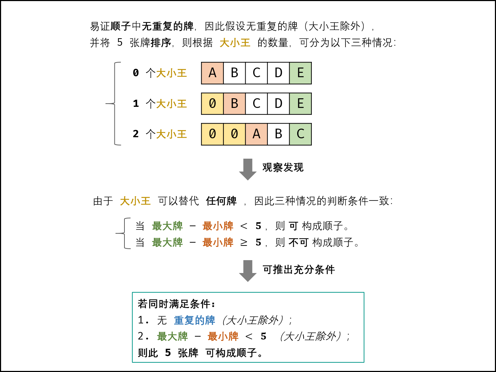

### 扑克牌中的顺子

> 题目:从若干副扑克牌中随机抽 5 张牌，判断是不是一个顺子，即这5张牌是不是连续的。2～10为数字本身，A为1，J为11，Q为12，K为13，而大、小王为 0 ，可以看成任意数字。A 不能视为 14。


示例 1：

```js
// 输入: [1,2,3,4,5]
// 输出: True
```

示例 2：

```js
// 输入: [0,0,1,2,5]
// 输出: True
```

限制:

* 数组长度为 5 
* 数组的数取值为 [0, 13]

### 思路分析

根据题意，我们可以知道，满足5张牌是顺子的条件如下:

1. 除了大小王以外，所有牌不能够重复。
2. 设此5张牌中最大值为max，最小值为min，当然要除开大小王，则一定满足:`max - min < 5`。

因此可以将问题转化为:此5张牌是否满足以上两个条件?如下图所示:



因此，我们可以采用set来去重，采用遍历来获取最大牌和最小牌，然后判断max - min < 5 是否成立即可。算法流程如下:

1. 遍历5张牌，遇到大小王，即为0时跳过。
2. 由于Set查找方法的时间复杂度为O(1),因此我们可以利用Set来实现遍历去重。
3. 获取最大牌和最小牌，然后返回max - min < 5即可。

```js
/**
 * @param {number[]} nums
 * @return {boolean}
 */
var isStraight = function(nums) {
    //注意max和min的初始值
    let max = 0,min = 14,repeat = new Set();
    for(let i = 0;i < nums.length;i++){
        // 等于0为大小王，因此跳过
        if(nums[i] === 0){
            continue;
        }
        // 找出最大牌和最小牌
        max = Math.max(max,nums[i]);
        min = Math.min(min,nums[i]);
        //判断是否重复
        if(repeat.has(nums[i])){
            return false;
        }
        repeat.add(nums[i]);
    }
    return max - min < 5;
};
```

时间复杂度 O(n) = O(5) = O(1)：其中 n 为 nums 长度，本题中 n === 5 ；遍历数组使用 O(n) 时间。
空间复杂度 O(n) = O(5) = O(1)：用于判重的辅助 Set 使用 O(n) 额外空间。


更多详细解题思路参考[题解](https://leetcode-cn.com/problems/bu-ke-pai-zhong-de-shun-zi-lcof/solution/mian-shi-ti-61-bu-ke-pai-zhong-de-shun-zi-ji-he-se/)。

