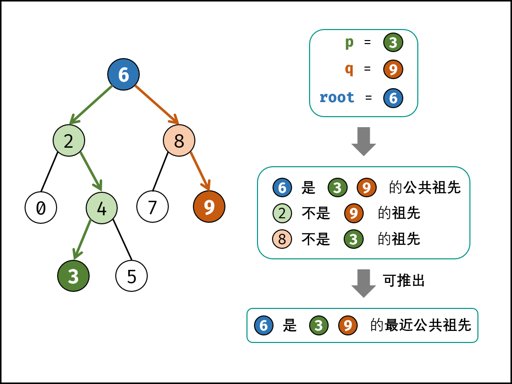

### 二叉搜索树的最近公共祖先(1)

> 题目:给定一个二叉搜索树, 找到该树中两个指定节点的最近公共祖先。

[百度百科](https://baike.baidu.com/item/%E6%9C%80%E8%BF%91%E5%85%AC%E5%85%B1%E7%A5%96%E5%85%88/8918834?fr=aladdin)中最近公共祖先的定义为：“对于有根树 T 的两个结点 p、q，最近公共祖先表示为一个结点 x，满足 x 是 p、q 的祖先且 x 的深度尽可能大（一个节点也可以是它自己的祖先）。”

例如，给定如下二叉搜索树:  root = [6,2,8,0,4,7,9,null,null,3,5]


示例 1：

```js
// 输入: root = [6,2,8,0,4,7,9,null,null,3,5], p = 2, q = 8
// 输出: 6 
// 解释: 节点 2 和节点 8 的最近公共祖先是 6。
```

示例 2：

```js
// 输入: root = [6,2,8,0,4,7,9,null,null,3,5], p = 2, q = 4
// 输出: 2
// 解释: 节点 2 和节点 4 的最近公共祖先是 2, 因为根据定义最近公共祖先节点可以为节点本身。
```

说明:

* 所有节点的值都是唯一的。
* p、q 为不同节点且均存在于给定的二叉搜索树中。

> 注意：本题与[主站 235 题](https://leetcode-cn.com/problems/lowest-common-ancestor-of-a-binary-search-tree/)相同。

### 思路分析

根据题意，我们可以得出对祖先节点的定义:

若节点p在节点root的左（右）子树，或节点p = root节点，则称root节点是p节点的祖先。如下图所示:


而最近公共祖先节点的定义为:

设节点root为节点p,q的某公共祖先节点，若其子左节点root.left和右子节点root.right都不是节点p,q的公共祖先节点，则称root节点为节点p,q的最近公共祖先节点。

根据以上的定义，若root节点为节点p,q的最近公共祖先节点，只可能为以下几种情况之一:

1. p节点 和 q节点 在root节点的子树中，且分别在root节点的异侧（即分别在左子树和右子树中）。

2. p = root,且q节点在root节点的左或右子树中。

3. q = root,且p节点在root节点的左或右子树中。

如下图所示:



并且，本题给定了2个重要的条件。

1. 树为`二叉搜索树`。

2. 树的所有节点值都是`唯一`的。

根据以上的条件，我们可以轻易的得出p节点,q节点与root节点的子树关系。如下:

* 若root.val < p.val,则p在root的右子树中。
* 若root.val > p.val,则p在root的左子树中。
* 若root.val = p.val,则p和root指向`同一节点`。

因此，本题我们可以使用迭代思路来解决，算法流程如下:

- 1. 循环搜索:当节点root为空时跳出。
    - 1.1 当p,q都在root的右子树中，则遍历至root.right。
    - 1.2 当p,q都在root的左子树中，则遍历至root.left。
    - 1.3 否则，说明找到了最近公共祖先节点，跳出。
- 2. 返回值：最近公共祖先root节点。


代码如下所示:

```js
/**
 * Definition for a binary tree node.
 * function TreeNode(val) {
 *     this.val = val;
 *     this.left = this.right = null;
 * }
 */
/**
 * @param {TreeNode} root
 * @param {TreeNode} p
 * @param {TreeNode} q
 * @return {TreeNode}
 */
var lowestCommonAncestor = function(root,p,q) {
    // root不为空时循环
    while(root !== null){
        // 遍历至右子树
        if(root.val < p.val && root.val < q.val){
            root = root.right;
        }
        // 遍历至左子树
        else if(root.val > p.val && root.val > q.val){
            root = root.left;
        }else{
            // 跳出循环
            break;
        }
    }
    // 返回root节点
    return root;
};
```

以上代码我们还可以做优化，那就是减少循环的判断。我们只要保证p节点的值小于q节点的值（反之同理）。那么在循环当中我们就只需要比较root节点和一个节点的值。为此我们创建一个临时节点temp来作为辅助交换值，如此一来我们就可以保证节点p的值一定小于节点q的值。代码如下:

```js
/**
 * Definition for a binary tree node.
 * function TreeNode(val) {
 *     this.val = val;
 *     this.left = this.right = null;
 * }
 */
/**
 * @param {TreeNode} root
 * @param {TreeNode} p
 * @param {TreeNode} q
 * @return {TreeNode}
 */
var lowestCommonAncestor = function(root,p,q) {
    // 如果p.val大于q.val,则交换
    if(p.val > q.val){
        // 创建辅助变量
        let temp = p;
        p = q;
        q = temp;
    }
    while(root !== null){
        // 遍历右子树
        if(root.val < p.val){
            root = root.right;
        }
        // 遍历左子树
        else if(root.val > q.val){
            root = root.left;
        }else{
            break;
        }
    }
    return root;
};
```


时间复杂度 O(n)： 其中 n 为二叉树节点数；每循环一轮排除一层，二叉搜索树的层数最小为 log<sup>n</sup>（满二叉树），最大为 n （退化为链表）。
空间复杂度 O(1)： 使用常数大小的额外空间。

既然我们可以使用迭代来解决，那就代表我们也可以通过递归来解决。在这里我们需要知道递归的条件。即:

1. 当节点p和q都在root节点的右子树中，递归root.right。
2. 当节点p和q都在root节点的左子树中，递归root.left。
3. 否则返回root节点，即最近的公共祖先节点。

代码如下所示:

```js
/**
 * Definition for a binary tree node.
 * function TreeNode(val) {
 *     this.val = val;
 *     this.left = this.right = null;
 * }
 */
/**
 * @param {TreeNode} root
 * @param {TreeNode} p
 * @param {TreeNode} q
 * @return {TreeNode}
 */
var lowestCommonAncestor = function(root,p,q) {
    // 递归右子树
    if(root.val < p.val && root.val < q.val){
        return lowestCommonAncestor(root.right,p,q);
    }
    // 递归左子树
    if(root.val > p.val && root.val > q.val){
        return lowestCommonAncestor(root.left,p,q);
    }
    return root;
};
```

时间复杂度 O(n)： 其中 n 为二叉树节点数；每循环一轮排除一层，二叉搜索树的层数最小为 log<sup>n</sup>（满二叉树），最大为 n （退化为链表）。
空间复杂度 O(n)： 最差情况下，即树退化为链表时，递归深度达到树的层数 n 。


[更多思路](https://leetcode-cn.com/problems/er-cha-sou-suo-shu-de-zui-jin-gong-gong-zu-xian-lcof/solution/mian-shi-ti-68-i-er-cha-sou-suo-shu-de-zui-jin-g-7/)。
