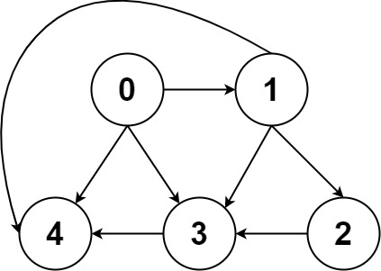

###  所有路径
 
> 题目:给定一个有 n 个节点的有向无环图，用二维数组 graph 表示，请找到所有从 0 到 n-1 的路径并输出（不要求按顺序）。

graph 的第 i 个数组中的单元都表示有向图中 i 号节点所能到达的下一些结点（译者注：有向图是有方向的，即规定了 a→b 你就不能从 b→a ），若为空，就是没有下一个节点了。

示例1：


```js
// 输入：graph = [[1,2],[3],[3],[]]
// 输出：[[0,1,3],[0,2,3]]
// 解释：有两条路径 0 -> 1 -> 3 和 0 -> 2 -> 3
```

示例2：



```js
// 输入：graph = [[4,3,1],[3,2,4],[3],[4],[]]
// 输出：[[0,4],[0,3,4],[0,1,3,4],[0,1,2,3,4],[0,1,4]]
```

示例3：

```js
// 输入：graph = [[1],[]]
// 输出：[[0,1]]
```

示例4：

```js
// 输入：graph = [[1,2,3],[2],[3],[]]
// 输出：[[0,1,2,3],[0,2,3],[0,3]]
```


示例5：

```js
// 输入：graph = [[1,3],[2],[3],[]]
// 输出：[[0,1,2,3],[0,3]]
```

提示:

* n == graph.length
* 2 <= n <= 15
* 0 <= graph[i][j] < n
* graph[i][j] != i 
* 保证输入为有向无环图 (GAD)

> 注意：本题与[主站 797 题](https://leetcode-cn.com/problems/all-paths-from-source-to-target/)相同。

### 思路分析

本题我们可以使用深度优先搜索算法来解答，具体地我们可以从0号点出发，使用栈记录路径上的点，每次我们遍历到点n-1，就将栈中记录的路径加入到答案中。由于本题中图为有向无环图(DAG),搜索过程中不会反复的遍历同一个点，因此我们无需判断当前点是否遍历过。


```js
/**
 * @param {number[][]} graph
 * @return {number[][]}
 */
var allPathsSourceTarget = function(graph) {
    const stack = [],
          res = [];
    const dfs = (x,n) => {
         if(x === n){
             res.push(stack.slice());
             return;
         }
         for(const y of graph[x]){
             stack.push(y);
             dfs(y,n);
             stack.pop();
         }
    }
    stack.push(0);
    dfs(0,graph.length - 1);
    return res;
};
```

以上算法的时间复杂度和空间复杂度分析如下:

* 时间复杂度：O(n * 2 ^ n)其中 n 为图中点的数量。我们可以找到一种最坏情况，即每一个点都可以去往编号比它大的点。此时路径数为 O(2 ^ n)，且每条路径长度为 O(n)，因此总时间复杂度为O(n * 2 ^ n)。
* 空间复杂度：O(n),其中 n 为点的数量。主要为栈空间的开销。注意返回值不计入空间复杂度。

[更多思路](https://leetcode.cn/problems/zlDJc7/solution/kai-mi-ma-suo-by-leetcode-solution-b964/)。
