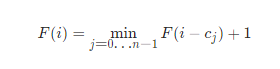

###  最少的硬币数目
 
> 题目:给定不同面额的硬币 coins 和一个总金额 amount。编写一个函数来计算可以凑成总金额所需的最少的硬币个数。如果没有任何一种硬币组合能组成总金额，返回 -1。

你可以认为每种硬币的数量是无限的。


示例1：

```js
// 输入：coins = [1, 2, 5], amount = 11
// 输出：3 
// 解释：11 = 5 + 5 + 1
```


示例2：

```js
// 输入：coins = [2], amount = 3
// 输出：-1
```


示例3：

```js
// 输入：coins = [1], amount = 0
// 输出：0
```


示例4：

```js
// 输入：coins = [1], amount = 1
// 输出：1
```


示例5：

```js
// 输入：coins = [1], amount = 1
// 输出：1
```

提示:

* 1 <= coins.length <= 12
* 1 <= coins[i] <= 2 ^ 31 - 1
* 0 <= amount <= 10 ^ 4


> 注意：本题与[主站 322 题](https://leetcode-cn.com/problems/coin-change/)相同。

### 思路分析

定义f(i)为组成金额i所需的最少硬币数量，假设在计算f(i)之前，我们就已经计算出了f(0) - f(i - 1)的答案，那么此时f(i)对应的转移方程应该为:



其中c[j]代表的是第j枚硬币的面值，即我们枚举最后一枚的硬币面额就是c[j]，那么需要从i - c[j]这个金额的状态f(i - c[j])转移过来，再算上枚举的这枚硬币数量1的贡献，由于要硬币数量最少，所以f(i)为前面能转移过来的状态的最小值加上枚举的硬币数量1。

我们来看2个例子，如下:

```js
// coins = [1, 2, 5], amount = 11
```

当i = 0时，无法用硬币组成，因此为0,当i < 0时，忽略f(i)。如下表所示:

|  f(i)   | 最小硬币数量  |
|  ----  | ----  |
|  f(0)  | 0 //金额为0,不能由硬币组成 |
|  f(1)  | 1 // f(1) = min(f(1 - 1),f(1 - 2),f(1 - 5)) + 1 = 1 |
|  f(2)  | 1 // f(2) = min(f(2 - 1),f(2 - 2),f(2 - 5)) + 1 = 1 |
|  f(3)  | 2 // f(3) = min(f(3 - 1),f(3 - 2),f(3 - 5)) + 1 = 2 |
|  f(4)  | 2 // f(4) = min(f(4 - 1),f(4 - 2),f(4 - 5)) + 1 = 2 |
|  ...   | ... |
|  f(11)  | 3 // f(11) = min(f(11 - 1),f(11 - 2),f(11 - 5)) + 1 = 3 |

我们可以看到问题的答案都是通过子问题的最优解得到的。再来看一个示例:

```js
// coins = [1, 2, 3], amount = 6
```
如下图所示:


在上图中，可以看到:

f(3) = min(f(3 - c[1]),f(3 - c[2]),f(3 - c[3])) + 1
     = min(f(3 - 1),f(3 - 2),f(3 - 3)) + 1;
     = min(f(2),f(1),f(0)) + 1
     = min(1,1,0) + 1
     = 1;


```js
/**
 * @param {number[]} coins
 * @param {number} amount
 * @return {number}
 */
var coinChange = function(coins, amount) {
    const max = amount + 1,
          dp = new Array(amount + 1).fill(max);
    dp[0] = 0;
    for(let i = 1;i <= amount;i++){
        for(let j = 0;j < coins.length;j++){
            if(coins[j] <= i){
                dp[i] = Math.min(dp[i],dp[i - coins[j]] + 1);
            }
        }
    }
    return dp[amount] > amount ? -1 : dp[amount];
};
```

以上算法的时间复杂度和空间复杂度分析如下:

* 时间复杂度：O(S * n)其中 S 是金额，n 是面额数。我们一共需要计算 O(S) 个状态，S 为题目所给的总金额。对于每个状态，每次需要枚举 n 个面额来转移状态，所以一共需要 O(S * n) 的时间复杂度。
* 空间复杂度：O(S),数组 dp 需要开长度为总金额 S 的空间。

[更多思路](https://leetcode-cn.com/problems/gaM7Ch/solution/zui-shao-de-ying-bi-shu-mu-by-leetcode-s-rm0w/)。
