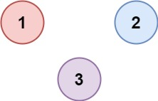

###  省份数量
 
> 题目:有 n 个城市，其中一些彼此相连，另一些没有相连。如果城市 a 与城市 b 直接相连，且城市 b 与城市 c 直接相连，那么城市 a 与城市 c 间接相连。

省份 是一组直接或间接相连的城市，组内不含其他没有相连的城市。

给你一个 n x n 的矩阵 isConnected ，其中 isConnected[i][j] = 1 表示第 i 个城市和第 j 个城市直接相连，而 isConnected[i][j] = 0 表示二者不直接相连。

返回矩阵中 省份 的数量。

示例1：


```js
// 输入：isConnected = [[1,1,0],[1,1,0],[0,0,1]]
// 输出：2
```

示例2：



```js
// 输入：isConnected = [[1,0,0],[0,1,0],[0,0,1]]
// 输出：3
```

提示:

* 1 <= n <= 200
* n == isConnected.length
* n == isConnected[i].length
* isConnected[i][j] 为 1 或 0
* isConnected[i][i] == 1
* isConnected[i][j] == isConnected[j][i]

> 注意：本题与[主站 547 题](https://leetcode-cn.com/problems/number-of-provinces/)相同。

### 思路分析

根据题意，我们可以把每一个城市看做是图当中的节点，城市与城市之间的相连就是连接每个图节点的边，要计算出省份的数量，实际上就是计算出城市与城市之间相连的边的数量。遍历图，我们可以使用深度优先搜索算法和广度优先搜索算法来解答，因此本题的解题思路也就很好理解了。

```js
/**
 * @param {number[][]} isConnected
 * @return {number}
 */
var findCircleNum = function(isConnected) {
    const cities = isConnected.length,
          visited = new Set();
    let provinces = 0;
    const dfs = (i) => {
        for(let j = 0;j < cities;j++){
            if(!visited.has(j) && isConnected[i][j] === 1){
                visited.add(j);
                dfs(j);
            }
        }
    }
    for(let i = 0;i < cities;i++){
        if(!visited.has(i)){
            dfs(i);
            provinces++;
        }
    }
    return provinces;
};
```

以上算法的时间复杂度和空间复杂度分析如下:

* 时间复杂度：O(n ^ 2),其中 n 是城市的数量。需要遍历矩阵 n 中的每个元素。
* 空间复杂度：O(n)其中 n 是城市的数量。需要使用数组 visited 记录每个城市是否被访问过，数组长度是 n，递归调用栈的深度不会超过 n。

[更多思路](https://leetcode.cn/problems/bLyHh0/solution/sheng-fen-shu-liang-by-leetcode-solution-c8b8/)。
