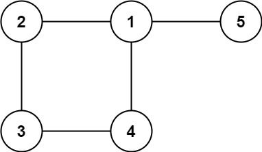

###  多余的边
 
> 题目:树可以看成是一个连通且 无环 的 无向 图。

给定往一棵 n 个节点 (节点值 1～n) 的树中添加一条边后的图。添加的边的两个顶点包含在 1 到 n 中间，且这条附加的边不属于树中已存在的边。图的信息记录于长度为 n 的二维数组 edges ，edges[i] = [ai, bi] 表示图中在 ai 和 bi 之间存在一条边。

请找出一条可以删去的边，删除后可使得剩余部分是一个有着 n 个节点的树。如果有多个答案，则返回数组 edges 中最后出现的边。

示例1：


```js
// 输入: edges = [[1,2],[1,3],[2,3]]
// 输出: [2,3]
```

示例2：



```js
// 输入: edges = [[1,2],[2,3],[3,4],[1,4],[1,5]]
// 输出: [1,4]
```

提示:

* n == edges.length
* 3 <= n <= 1000
* edges[i].length == 2
* 1 <= ai < bi <= edges.length
* ai != bi
* edges 中无重复元素
* 给定的图是连通的 

> 注意：本题与[主站 684 题](https://leetcode-cn.com/problems/redundant-connection/)相同。

### 思路分析


```js
/**
 * @param {number[][]} edges
 * @return {number[]}
 */
var findRedundantConnection = function(edges) {

};
```

以上算法的时间复杂度和空间复杂度分析如下:

* 时间复杂度：O()。
* 空间复杂度：O()。

[更多思路](https://leetcode.cn/problems/bLyHh0/solution/sheng-fen-shu-liang-by-leetcode-solution-c8b8/)。
