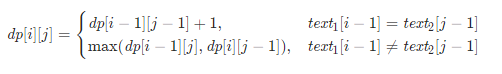

###  最长公共子序列 

> 题目:给定两个字符串 text1 和 text2，返回这两个字符串的最长 公共子序列 的长度。如果不存在 公共子序列 ，返回 0 。

一个字符串的 子序列 是指这样一个新的字符串：它是由原字符串在不改变字符的相对顺序的情况下删除某些字符（也可以不删除任何字符）后组成的新字符串。

例如，"ace" 是 "abcde" 的子序列，但 "aec" 不是 "abcde" 的子序列。
两个字符串的 公共子序列 是这两个字符串所共同拥有的子序列。

示例1：

```js
// 输入：text1 = "abcde", text2 = "ace" 
// 输出：3  
// 解释：最长公共子序列是 "ace" ，它的长度为 3 。
```


示例2：

```js
// 输入：text1 = "abc", text2 = "abc"
// 输出：3
// 解释：最长公共子序列是 "abc" ，它的长度为 3 。
```


示例3：

```js
// 输入：text1 = "abc", text2 = "def"
// 输出：0
// 解释：两个字符串没有公共子序列，返回 0 。
```


提示:

* 1 <= text1.length, text2.length <= 1000
* text1 和 text2 仅由小写英文字符组成。


> 注意：本题与[主站 1143 题](https://leetcode-cn.com/problems/longest-common-subsequence/)相同。

### 思路分析

本题是一个典型的二维动态规划问题，假设字符串text1和text2的长度分别为m和n，创建m + 1行n + 1列的二维数组dp，其中dp[i][j]表示text1[0:i]和text2[0:j]的最长公共子序列的长度。

> 在上述表示中，text1[0:i]表示text1的长度为i的前缀，text2[0:j]表示text2的长度为j的前缀。

考虑动态规划边界的情况:

* 当i = 0时，text1[0 : i]为空，空字符串和任何字符串的最长公共子序列的长度都是0，因此对任意的0 <= j <= n,有dp[0][j] = 0;
* 当j = 0时，text2[0 : j]为空，同理可得，对任意的0 <= i <= m,有dp[i][0] = 0

因此动态规划的边界情况是:当i = 0或j = 0时，dp[i][j] = 0。

当i > 0且j > 0时，考虑dp[i][j]的计算:

* 当text1[i - 1] = text2[j - 1]时，将这两个相同的字符称作是公共字符，考虑text1[0 : i - 1]和text2[0 : j - 1]的最长公共子序列，再增加一个字符（即公共字符）即可得到text1[0 : i]和text2[0 : j]的最长公共子序列，因此dp[i][j] = dp[i - 1][j - 1] + 1。

* 当text1[i - 1] !== text2[j - 1]时，考虑以下两项:
    * text1[0 : i - 1]和text2[0 : j]的最长公共子序列。
    * text1[0 : i]和text2[0 : j - 1]的最长公共子序列。

要想得到text1[0 : i]和text2[0 : j]的最长公共子序列，应该取两者中的长度的较大的一项，因此dp[i][j] = max(dp[i - 1][j],dp[i][j - 1])。由此可以得到如下状态转移方程:



最终计算的得到dp[m][n]即为text1和text2的最长公共子序列的长度。


```js
/**
 * @param {string} text1
 * @param {string} text2
 * @return {number}
 * 
 */
var longestCommonSubsequence = function(text1, text2) {
    const m = text1.length,n = text2.length;
    const dp = new Array(m + 1).fill(0).map(() => new Array(n + 1).fill(0));
    for(let i = 1;i <= m;i++){
        const c1 = text1[i - 1];
        for(let j = 1;j <= n;j++){
            const c2 = text2[j - 1];
            if(c1 === c2){
                dp[i][j] = dp[i - 1][j - 1] + 1;
            }else{
                dp[i][j] = Math.max(dp[i - 1][j],dp[i][j - 1]);
            }
        }
    }
    return dp[m][n];
}
```

以上算法的时间复杂度和空间复杂度分析如下:

* 时间复杂度：O(m * n)，其中m为字符串text1的长度,n为字符串text2的长度，二维数组dp有m + 1行和n + 1列，需要对dp中的每个元素进行计算。
* 空间复杂度：O(m * n),其中m为字符串text1的长度,n为字符串text2的长度，创建了m + 1行n + 1列的二维数组dp。


[更多思路](https://leetcode-cn.com/problems/qJnOS7/solution/zui-chang-gong-gong-zi-xu-lie-by-leetcod-ugg7/)。
