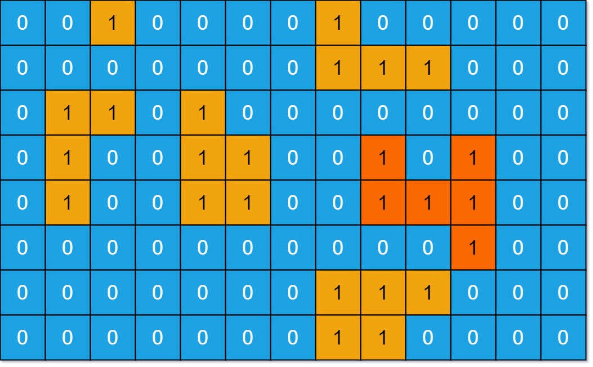

###  岛屿的最大面积
 
> 题目:给定一个由 0 和 1 组成的非空二维数组 grid ，用来表示海洋岛屿地图。

一个 岛屿 是由一些相邻的 1 (代表土地) 构成的组合，这里的「相邻」要求两个 1 必须在水平或者竖直方向上相邻。你可以假设 grid 的四个边缘都被 0（代表水）包围着。

找到给定的二维数组中最大的岛屿面积。如果没有岛屿，则返回面积为 0 。

示例1：



```js
// 输入: grid = [[0,0,1,0,0,0,0,1,0,0,0,0,0],[0,0,0,0,0,0,0,1,1,1,0,0,0],[0,1,1,0,1,0,0,0,0,0,0,0,0],[0,1,0,0,1,1,0,0,1,0,1,0,0],[0,1,0,0,1,1,0,0,1,1,1,0,0],[0,0,0,0,0,0,0,0,0,0,1,0,0],[0,0,0,0,0,0,0,1,1,1,0,0,0],[0,0,0,0,0,0,0,1,1,0,0,0,0]]
// 输出: 6
// 解释: 对于上面这个给定矩阵应返回 6。注意答案不应该是 11 ，因为岛屿只能包含水平或垂直的四个方向的 1 。
```

示例2：

```js
// 输入: grid = [[0,0,0,0,0,0,0,0]]
// 输出: 0
```

提示:

* m == grid.length
* n == grid[i].length
* 1 <= m, n <= 50
* grid[i][j] is either 0 or 1


> 注意：本题与[主站 695 题](https://leetcode-cn.com/problems/max-area-of-island/)相同。

### 思路分析

本题我们可以使用深度优先搜素算法来解答，首先我们找出所有岛屿的面积，然后找出最大值。然后我们需要找出某一岛屿的面积，找出某一岛屿的面积，我们需要从某个位置出发，从水平和垂直方向沿着上下左右探寻相连的土地，每次探寻到土地，就用一个计数器来计数，给该计数器加1，然后我们需要确保每一块土地都只会被探寻一次。在深度优先搜索每一个岛屿的时候，我们需要确保边界条件,因为是二维矩阵从行和列的角度去考虑边界条件。

```js
var dfs = function(grid,i,j){
    // 边界条件
    if(i < 0 || j < 0 || i === grid.length || j === grid[0].length || grid[i][j] !== 1){
        return 0;
    }
    // 重置土地
    grid[i][j] = 0;
    const dx = [0,0,1,-1],dy = [1,-1,0,0];
    let count = 1;
    for(let k = 0;k < 4;k++){
        let next_i = i + dx[k],next_j = j + dy[k];
        count += dfs(grid,next_i,next_j);
    }
    return count;
}
/**
 * @param {number[][]} grid
 * @return {number}
 */
var maxAreaOfIsland = function(grid) {
    let maxArea = 0;
    const m = grid.length,n = grid[0].length;
    for(let i = 0;i < m;i++){
        for(let j = 0;j < n;j++){
            maxArea = Math.max(maxArea,dfs(grid,i,j));
        }
    }
    return maxArea;
};
```

以上算法的时间复杂度和空间复杂度分析如下:

* 时间复杂度：O(m * n),其中 m 是给定网格中的行数，n 是列数。我们访问每个网格最多一次。
* 空间复杂度：O(m * n),递归的深度最大可能是整个网格的大小，因此最大可能使用 O(m * n) 的栈空间。

[更多思路](https://leetcode-cn.com/problems/ZL6zAn/solution/dao-yu-de-zui-da-mian-ji-by-leetcode-sol-c9ni/)。
