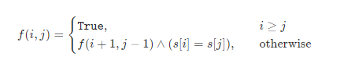

###  最少回文分割 

> 题目:给定一个字符串 s，请将 s 分割成一些子串，使每个子串都是回文串。返回符合要求的 最少分割次数 。

示例1：

```js
// 输入：s = "aab"
// 输出：1
// 解释：只需一次分割就可将 s 分割成 ["aa","b"] 这样两个回文子串。
```


示例2：

```js
// 输入：s = "a"
// 输出：0
```


示例3：

```js
// 输入：s = "ab"
// 输出：1
```


提示:

* 1 <= s.length <= 2000
* s 仅由小写英文字母组成


> 注意：本题与[主站 132 题](https://leetcode-cn.com/problems/palindrome-partitioning-ii/)相同。

### 思路分析

设f[i]表示字符串的前缀s[0...i]的最少分割次数。要想得出f[i]的值，我们可以考虑枚举s[0...i]分割出的最后一个回文串，这样我们就可以写出状态转移方程:

f[i] = min{f[j]}(0 <= j < i) + 1,其中s[j + 1,i]是一个回文串

即我们枚举最后一个回文串的起始位置是j + 1,保证s[j + 1..i]是一个回文串，那么f[i]就可以从f[i]转移而来，附加1次额外分割次数。

注意到上面的状态转移方程当中，我们还少考虑了一种情况，即s[0...i]本身就是一个回文字符串，此时其不需要进行分割，即f[i] = 0。那么我们如何知道s[j + 1..i]或者s[0..i]是一个回文字符串呢？

当我们在判断s[i..j]是否为回文字符串时，常规的方法是使用双指针分别指向i和j，每次判断两个指针指向的字符是否相同，直到两个指针相遇。然而这种方法会产生重复计算，例如下面这个例子:

> 当s = aaba 时，对于前2个字符aa,我们有两种分割方法[aa]和[a,a],当我们每一次搜索到字符串的第i = 2个字符b时，都需要对每个s[i..j]使用双指针判断其是否为回文串，这就产生了重复计算。

因此，我们可以将字符串s的每个子串s[i..j]是否为回文串预先处理出来，使用动态规划即可。设f(i,j)表示s[i..j]是否为回文串，那么则有状态转移方程:

​

其中^表示逻辑与运算，即s[i..j]为回文串，当且仅当其为空串(i > j),其长度为1(i == j),或者其首尾字符相同且s[i + 1..j - 1]为回文串。预处理完成之后，我们只需要O(1)的时间就可以判断任意s[i..j]是否为回文串了。通过动态规划计算出所有的f值之后，最终的答案即为f[n - 1]，其中n是字符串s的长度。


```js
/**
 * @param {string} s
 * @return {number}
 */
var minCut = function(s) {
    const n = s.length,
          g = new Array(n).fill(0).map(i => new Array(n).fill(true));
    for(let i = n - 1;i >= 0;i--){
        for(let j = i + 1;j < n;j++){
            g[i][j] = g[i + 1][j - 1] && s[i] === s[j];
        }
    }

    const f = new Array(n).fill(Number.MAX_SAFE_INTEGER);

    for(let i = 0;i < n;i++){
        if(g[0][i]){
            f[i] = 0;
        }else{
            for(let j = 0;j < i;j++){
                if(g[j + 1][i]){
                    f[i] = Math.min(f[i],f[j] + 1);
                }
            }
        }
    }

    return f[n - 1];
};
```

以上算法的时间复杂度和空间复杂度分析如下:

* 时间复杂度：O(n ^ 2)，其中n是字符串s的长度，预处理计算g和动态规划计算f的时间复杂度均为O(n ^ 2)。
* 空间复杂度：O(n ^ 2),数组g需要O(n ^ 2)的空间，数组f需要O(n)的空间。


[更多思路](https://leetcode-cn.com/problems/Q91FMA/solution/jian-zhi-offer-2-mian-shi-ti-93-shu-zhon-2ww4/)。
