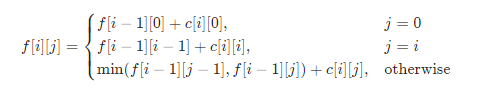

###  三角形中最小路径之和
 
> 题目:给定一个三角形 triangle ，找出自顶向下的最小路径和。

每一步只能移动到下一行中相邻的结点上。相邻的结点 在这里指的是 下标 与 上一层结点下标 相同或者等于 上一层结点下标 + 1 的两个结点。也就是说，如果正位于当前行的下标 i ，那么下一步可以移动到下一行的下标 i 或 i + 1 。

示例1：

```js
// 输入：triangle = [[2],[3,4],[6,5,7],[4,1,8,3]]
// 输出：11
// 解释：如下面简图所示：
//    2
//   3 4
//  6 5 7
// 4 1 8 3
// 自顶向下的最小路径和为 11（即，2 + 3 + 5 + 1 = 11）。
```


示例2：

```js
// 输入：triangle = [[-10]]
// 输出：-10
```

提示:

* 1 <= triangle.length <= 200
* triangle[0].length == 1
* triangle[i].length == triangle[i - 1].length + 1
* -10 ^ 4 <= triangle[i][j] <= 10 ^ 4

> 进阶: 你可以只使用 O(n) 的额外空间（n 为三角形的总行数）来解决这个问题吗？

> 注意：本题与[主站 120 题](https://leetcode-cn.com/problems/triangle/)相同。

### 思路分析

本题是一道非常经典且历史悠久的动态规划算法题，其作为算法题出现，最早可以追溯到1994年的IOI（国际信息学奥林匹克竞赛）的[The Triangle](https://ioinformatics.org/files/ioi1994problem1.pdf)时光飞逝，经过 20 多年的沉淀，往日的国际竞赛题如今已经变成了动态规划的入门必做题，不断督促着我们学习和巩固算法。

在本题中，给定的三角形的行数为 n，并且第 i 行（从 0 开始编号）包含了 i+1 个数。如果将每一行的左端对齐，那么会形成一个等腰直角三角形，如下所示：

```js
// [2]
// [3,4]
// [6,5,7]
// [4,1,8,3]
```

我们使用f[i][j]表示从三角形顶部走到位置(i,j)的最小路径和。这里的位置(i,j)指的就是三角形中第i行第j列（均从0开始编号）的位置。由于每一步只能移动到下一行「相邻的节点」上，因此想要走到位置(i,j)，上一步只可能是在位置(i - 1,j - 1)或者位置(i - 1,j)。我们在这两个位置当中选择一个路径和较小的来进行转移，因此状态转移方程为:

f[i][j] = min(f[i - 1][j - 1],f[i - 1][j]) + c[i][j]

其中c[i][j]表示位置(i,j)对应的元素值。

注意第i行有i + 1个元素，它们对应的j的范围为[0,i]。当j = 0或者j = i的时候，上述状态转移方程有一些项是没有意义的。例如当j = 0时,f[i - 1][j - 1]没有意义，因此状态转移方程为:

f[i][0] = f[i - 1][0] + c[i][0]

即当我们在第i行的最左侧时，我们只能从第i - 1行的最左侧移动过来，当j = i时，f[i - 1][j]没有意义，因此状态转移方程为:

f[i][i] = f[i - 1][i - 1] + c[i][i]

即当我们在第i行的最右侧的时候，我们只能从第i - 1行的最右侧移动过来。最终的答案即为f[n - 1][0]到f[n - 1][n - 1]的最小值，其中n是三角形的行数。

在这里我们还需要注意一点，那就是状态转移方程的边界条件是什么？由于我们已经去除了所有无意义的状态，因此边界条件可以定为:

f[0][0] = c[0][0]

即在三角形的顶部时，最小路径和就等于对应元素位置的元素值。这样一来，我们从1开始递增的枚举i，并在[0,i]的范围递增的枚举j，就可以完成所有状态的计算。


```js
/**
 * @param {number[][]} triangle
 * @return {number}
 */
var minimumTotal = function(triangle) {
    const n = triangle.length,
          f = new Array(n).fill(0).map(() => new Array().fill(0));
    f[0][0] = triangle[0][0];
    for(let i = 1;i < n;i++){
        f[i][0] = f[i - 1][0] + triangle[i][0];
        for(let j = 1;j < i;j++){
            f[i][j] = Math.min(f[i - 1][j - 1],f[i - 1][j]) + triangle[i][j];
        }
        f[i][i] = f[i - 1][i - 1] + triangle[i][i];
    }
    let minTotal = f[n - 1][0];
    for(let i = 1;i < n;i++){
        minTotal = Math.min(minTotal,f[n - 1][i]);
    }
    return minTotal;
};
```

以上算法的时间复杂度和空间复杂度分析如下:

* 时间复杂度：O(n ^ 2),其中 n 是三角形的行数。
* 空间复杂度：O(n ^ 2),我们需要一个 n*n 的二维数组存放所有的状态。

在题目描述当中的进阶部分，提到了可以将空间复杂度优化至O(n)。我们回顾一下前面所述的状态转移方程:



可以发现，f[i][j]只与f[i - 1][..]有关，而与f[i - 2][..]以及之前的状态无关，因此我们不必存储这些无关的状态。具体地，我们使用两个长度为n的一维数组进行转移，将i根据奇偶性映射到其中一个一维数组，那么i - 1就映射到另一个一维数组。这样，我们就可以使用两个一维数组，交替的进行状态转移。


```js
/**
 * @param {number[][]} triangle
 * @return {number}
 */
var minimumTotal = function(triangle) {
    const n = triangle.length,
          f = new Array(2).fill(0).map(() => new Array(n));
    f[0][0] = triangle[0][0];
    for(let i = 1;i < n;i++){
        let cur = i % 2,prev = 1 - cur;
        f[cur][0] = f[prev][0] + triangle[i][0];
        for(let j = 1;j < i;j++){
            f[cur][j] = Math.min(f[prev][j - 1],f[prev][j]) + triangle[i][j];
        }
        f[cur][i] = f[prev][i - 1] + triangle[i][i]; 
    }
    let minTotal = f[(n - 1) % 2][0];
    for(let i = 1;i < n;i++){
        minTotal = Math.min(minTotal,f[(n - 1) % 2][i]);
    }
    return minTotal;
};
```

以上算法的时间复杂度和空间复杂度分析如下:

* 时间复杂度：O(n ^ 2),其中 n 是三角形的行数。
* 空间复杂度：O(2 * n)，省略常数空间为O(n),需要2 * n个数组存储状态，其中n是三角形的行数。

事实上，我们还可以对空间复杂度进行优化。我们从i到0递减的枚举j，这样我们就只需要一个长度为n的一维数组f，就可以完成状态转移。

> 为什么只有在递减的枚举j时，才能省去一个一维数组？当我们在计算位置(i,j)时，f[j + 1]到f[i]已经是第i行的值，而f[0]到f[j]仍然是第i - 1行的值。此时我们直接通过:

f[j] = min(f[j - 1],f[j]) + c[i][j]

> 进行转移，恰好就是在(i - 1,j - 1)和(i - 1,j)当中进行选择。但如果我们递增的枚举j，那么在计算位置(i,j)时,f[0]到f[j - 1]已经是第i行的值。如果我们仍然使用上述的状态转移方程，那么是在(i,j - 1)和(i - 1,j)中进行选择，就产生了错误。

这样虽然空间复杂度仍然为 O(n)，但我们只使用了 n 的空间存储状态，减少了一半的空间消耗。

```js
/**
 * @param {number[][]} triangle
 * @return {number}
 */
var minimumTotal = function(triangle) {
    const n =  triangle.length,
          f = new Array(n).fill(0);
    f[0] = triangle[0][0];
    for(let i = 1;i < n;i++){
        f[i] = f[i - 1] + triangle[i][i];
        for(let j = i - 1;j > 0;j--){
            f[j] = Math.min(f[j - 1],f[j]) + triangle[i][j];
        }
        f[0] += triangle[i][0];
    }
    let minTotal = f[0];
    for(let i = 1;i < n;i++){
        minTotal = Math.min(minTotal,f[i])
    }
    return minTotal;
};
```

以上算法的时间复杂度和空间复杂度分析如下:

* 时间复杂度：O(n ^ 2),其中 n 是三角形的行数。
* 空间复杂度：O(n),使用n个空间存储状态，其中n是三角形的行数。

本题还有一些其它的动态规划方法，例如：

* 从三角形的底部开始转移，到顶部结束；
* 直接在给定的三角形数组上进行状态转移，不使用额外的空间。

读者可以自行尝试。如果在面试中遇到类似的题目，需要和面试官进行沟通，可以询问「是否有空间复杂度限制」「是否可以修改原数组」等问题，给出符合条件的算法。

[更多思路](https://leetcode-cn.com/problems/IlPe0q/solution/san-jiao-xing-zhong-zui-xiao-lu-jing-zhi-srun/)。
