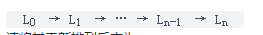
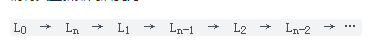

### 重排链表

> 题目:给定一个单链表 L 的头节点 head ，单链表 L 表示为：



请将其重新排列后变为：



不能只是单纯的改变节点内部的值，而是需要实际的进行节点交换。

示例 1：


```js
// 输入: head = [1,2,3,4]
// 输出: [1,4,2,3]
```

示例 2：


```js
// 输入: head = [1,2,3,4,5]
// 输出: [1,5,2,4,3]
```


提示:

* 链表的长度范围为 [1, 5 * 10 ^ 4]
* 1 <= node.val <= 1000

> 注意：本题与[主站 143 题](https://leetcode-cn.com/problems/reorder-list/)相同。

### 思路分析

由于链表不支持下标访问，因此我们可以创建一个辅助栈（类数组）的结构来存储链表节点，这样我们就可以按照题意的规则通过栈来修改链表节点的指向呢。代码如下:

```js
/**
 * Definition for singly-linked list.
 * function ListNode(val, next) {
 *     this.val = (val===undefined ? 0 : val)
 *     this.next = (next===undefined ? null : next)
 * }
 */
/**
 * @param {ListNode} head
 * @return {void} Do not return anything, modify head in-place instead.
 */
var reorderList = function(head) {
    //如果是空链表则直接返回
    if(head === null || head.next === null){
        return head;
    }
    //创建一个辅助栈
    const stack = [];
    let node = head;
    head = head.next;
    //链表节点入栈
    while(head !== null){
        node.next = null;
        stack.push(node);
        node = head;
        head = head.next;
    }
    stack.push(node);
    //构建双指针
    let i = 0,j = stack.length - 1,res = stack[0];
    //双指针循环，直到i小于j为止
    while(i < j){
        stack[i].next = stack[j];
        i++;
        //如果i和j相等，则代表已经走完了链表，需要跳出循环
        if(i === j){
            break;
        }
        stack[j].next = stack[i];
        j--;
    }
    if(i === j - 1){
        stack[i].next = stack[j];
    }
    return res;
};
```

以上算法的时间复杂度和空间复杂度分析如下:

* 时间复杂度：O(n)。
* 空间复杂度：O(n)。


[更多思路](https://leetcode-cn.com/problems/LGjMqU/solution/zhong-pai-lian-biao-by-leetcode-solution-wm25/)。
