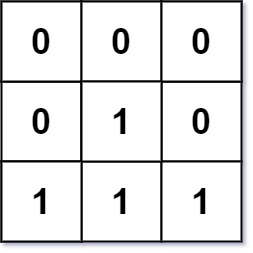
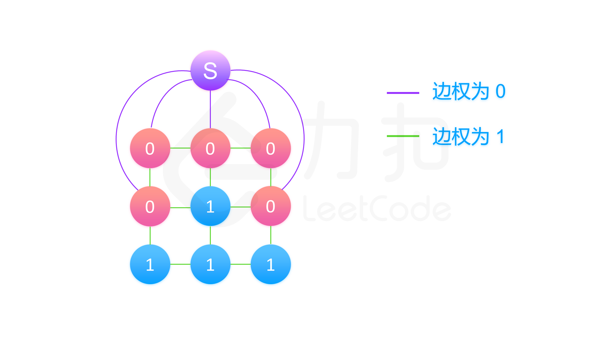

###  矩阵中的距离
 
> 题目:给定一个由 0 和 1 组成的矩阵 mat ，请输出一个大小相同的矩阵，其中每一个格子是 mat 中对应位置元素到最近的 0 的距离。

两个相邻元素间的距离为 1 。

示例1：


```js
// 输入：mat = [[0,0,0],[0,1,0],[0,0,0]]
// 输出：[[0,0,0],[0,1,0],[0,0,0]]
```

示例2：



```js
// 输入：mat = [[0,0,0],[0,1,0],[1,1,1]]
// 输出：[[0,0,0],[0,1,0],[1,2,1]]
```

提示:

* m == mat.length
* n == mat[i].length
* 1 <= m, n <= 104
* 1 <= m * n <= 104
* mat[i][j] is either 0 or 1.
* mat 中至少有一个 0 

> 注意：本题与[主站 542 题](https://leetcode-cn.com/problems/01-matrix/)相同。

### 思路分析

对于矩阵中的每一个元素，如果它的值为 0，那么离它最近的 0 就是它自己。如果它的值为 1，那么我们就需要找出离它最近的 0，并且返回这个距离值。那么我们如何对于矩阵中的每一个 1，都快速地找到离它最近的 0 呢？

我们不妨从一个简化版本的问题开始考虑起。假设这个矩阵中恰好只有一个 0，我们应该怎么做？由于矩阵中只有一个 0，那么对于每一个 1，离它最近的 0 就是那个唯一的 0。如何求出这个距离呢？我们可以想到两种做法：

* 如果 0 在矩阵中的位置是 (i_0, j_0)，11 在矩阵中的位置是 (i_1, j_1)，那么我们可以直接算出 0 和 1 之间的距离。因为我们从 1 到 0 需要在水平方向走 |i_0 - i_1| 步，竖直方向走 |j_0 - j_1|步，那么它们之间的距离就为 |i_0 - i_1| + |j_0 - j_1|；

* 我们可以从 0 的位置开始进行 广度优先搜索。广度优先搜索可以找到从起点到其余所有点的最短距离，因此如果我们从 0 开始搜索，每次搜索到一个 1，就可以得到 0 到这个 1 的最短距离，也就离这个 1 最近的 0 的距离了（因为矩阵中只有一个 0）。举个例子，如果我们的矩阵为：

```js
// _ _ _ _
// _ 0 _ _
// _ _ _ _
// _ _ _ _
```

其中只有一个 0，剩余的 1 我们用短横线表示。如果我们从 0 开始进行广度优先搜索，那么结果依次为：

```js
// _ _ _ _         _ 1 _ _         2 1 2 _         2 1 2 3         2 1 2 3
// _ 0 _ _   ==>   1 0 1 _   ==>   1 0 1 2   ==>   1 0 1 2   ==>   1 0 1 2
// _ _ _ _         _ 1 _ _         2 1 2 _         2 1 2 3         2 1 2 3
// _ _ _ _         _ _ _ _         _ 2 _ _         3 2 3 _         3 2 3 4
```

也就是说，在广度优先搜索的每一步中，如果我们从矩阵中的位置 x 搜索到了位置 y，并且 y 还没有被搜索过，那么位置 y 离 0 的距离就等于位置 x 离 0 的距离加上 1。

对于上面的两种做法，第一种看上去简洁有效，只需要对每一个位置计算就行；第二种需要实现广度优先搜索，会复杂一些。但是，别忘了我们的题目中会有不止一个 0，这样以来，如果我们要使用第一种做法，就必须对于每个 1 计算一次它到所有的 0 的距离，再从中取一个最小值，时间复杂度会非常高，无法通过本地。而对于第二种做法，我们可以很有效地处理有多个 0 的情况。

> 事实上，第一种做法也是可以处理多个 0 的情况的，但没有那么直观。感兴趣的读者可以在理解完方法一（即本方法）之后阅读方法二，那里介绍了第一种做法是如何扩展的。

处理的方法很简单：我们在进行广度优先搜索的时候会使用到队列，在只有一个 0 的时候，我们在搜索前会把这个 0 的位置加入队列，才能开始进行搜索；如果有多个 0，我们只需要把这些 0 的位置都加入队列就行了。

我们还是举一个例子，在这个例子中，有两个 0：

```js
// _ _ _ _
// _ 0 _ _
// _ _ 0 _
// _ _ _ _
```

我们会把这两个 0 的位置都加入初始队列中，随后我们进行广度优先搜索，找到所有距离为 1 的 1：

```js
// _ 1 _ _
// 1 0 1 _
// _ 1 0 1
// _ _ 1 _
```

接着重复步骤，直到搜索完成：

```js
// _ 1 _ _         2 1 2 _         2 1 2 3
// 1 0 1 _   ==>   1 0 1 2   ==>   1 0 1 2
// _ 1 0 1         2 1 0 1         2 1 0 1
// _ _ 1 _         _ 2 1 2         3 2 1 2
```

这样做为什么是正确的呢？

* 我们需要对于每一个 1 找到离它最近的 0。如果只有一个 0 的话，我们从这个 0 开始广度优先搜索就可以完成任务了；
* 但在实际的题目中，我们会有不止一个 0。我们会想，要是我们可以把这些 0 看成一个整体好了。有了这样的想法，我们可以添加一个「超级零」，它与矩阵中所有的 0 相连，这样的话，任意一个 1 到它最近的 0 的距离，会等于这个 1 到「超级零」的距离减去一。由于我们只有一个「超级零」，我们就以它为起点进行广度优先搜索。这个「超级零」只和矩阵中的 0 相连，所以在广度优先搜索的第一步中，「超级零」会被弹出队列，而所有的 0 会被加入队列，它们到「超级零」的距离为 1。这就等价于：一开始我们就将所有的 0 加入队列，它们的初始距离为 0。这样以来，在广度优先搜索的过程中，我们每遇到一个 1，就得到了它到「超级零」的距离减去一，也就是 这个 1 到最近的 0 的距离。

下图中就展示了我们方法：



熟悉「最短路」的读者应该知道，我们所说的「超级零」实际上就是一个「超级源点」。在最短路问题中，如果我们要求多个源点出发的最短路时，一般我们都会建立一个「超级源点」连向所有的源点，用「超级源点」到终点的最短路等价多个源点到终点的最短路。


```js
/**
 * @param {number[][]} mat
 * @return {number[][]}
 */
var updateMatrix = function(mat) {
    const m = mat.length,n = mat[0].length,
          dirs = [[-1,0],[1,0],[0,1],[0,-1]],
          res = new Array(m).fill(0).map(() => new Array(n).fill(0)),
          queue = [];
    for(let i = 0;i < m;i++){
        for(let j = 0;j < n;j++){
            if(mat[i][j] === 0){
                queue.push([i,j]);
                res[i][j] = 0;
            }else{
                res[i][j] = Number.MAX_SAFE_INTEGER;
            }
        }
    }
    while(queue.length){
        const first = queue.shift(),
              i = first[0],
              j = first[1];
              dist = res[i][j];
        for(const dir of dirs){
            let ni = i + dir[0],
                nj = j + dir[1];
            if(ni >= 0 && ni < m && nj >= 0 && nj < n){
                if(res[ni][nj] > dist + 1){
                    res[ni][nj] = dist + 1;
                    queue.push([ni,nj]);
                }
            }
        }

    }
    return res;
};
```

以上算法的时间复杂度和空间复杂度分析如下:

* 时间复杂度：O(m * n),其中 m 为矩阵行数，n 为矩阵列数，即矩阵元素个数。广度优先搜索中每个位置最多只会被加入队列一次，因此只需要 O(m * n) 的时间复杂度。
* 空间复杂度：O(m * n),其中 m 为矩阵行数，n 为矩阵列数，即矩阵元素个数。除答案数组外，最坏情况下矩阵里所有元素都为 0，全部被加入队列中，此时需要 O(m * n) 的空间复杂度。

[更多思路](https://leetcode-cn.com/problems/2bCMpM/solution/ju-zhen-zhong-de-ju-chi-by-leetcode-solu-0sxk/)。
