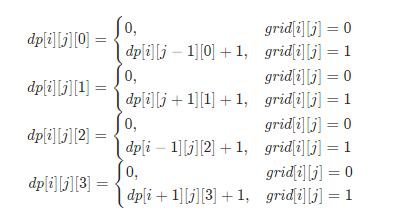
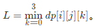

### 最大加号标志

> 题目: 在一个 n x n 的矩阵 grid 中，除了在数组 mines 中给出的元素为 0，其他每个元素都为 1。mines[i] = [xi, yi]表示 grid[xi][yi] == 0

返回  grid 中包含 1 的最大的 轴对齐 加号标志的阶数 。如果未找到加号标志，则返回 0 。

一个 k 阶由 1 组成的 “轴对称”加号标志 具有中心网格 grid[r][c] == 1 ，以及4个从中心向上、向下、向左、向右延伸，长度为 k-1，由 1 组成的臂。注意，只有加号标志的所有网格要求为 1 ，别的网格可能为 0 也可能为 1 。


示例 1：


```js
// 输入: n = 5, mines = [[4, 2]]
// 输出: 2
// 解释: 在上面的网格中，最大加号标志的阶只能是2。一个标志已在图中标出。
```

示例 2：


```js
// 输入: n = 1, mines = [[0, 0]]
// 输出: 0
// 解释: 没有加号标志，返回 0 。
```

提示:

* 1 <= n <= 500
* 1 <= mines.length <= 5000
* 0 <= xi, yi < n
* 每一对 (xi, yi) 都 不重复

### 思路分析

对于每个中心点坐标 (i, j)，分别从上下左右四个方向计算从 (i, j) 开始最长连续 1 的个数。设 dp[i][j][k] 表示以 (i, j) 为起点在方向 k 上的连续 1 的最大数目：

* 如果 grid[i][j] 为 0，那么此时该方向的连续 1 的最大数目为 0；
* 如果 grid[i][j] 为 1, 那么此时该方向的连续 1 的最大数目为该方向上前一个单元为起点的最大数目加 1；

假设当前 k = 0,1,2,3 时，分别表示方向为左、右、上、下，则我们可以得到递推公式如下：




假设网格中有一行为 01110110，当前方向为向左，那么对应的连续 1 的个数就是 012301201。以每个点为 (i,j) 为中心的四个方向中最小连续 1 的个数即为以其为中心构成的加号标志的最大阶数，我们用公式表示如下图所示0"



在实际计算时，我们为了方便计算只用 dp[i][j] 保存四个方向中最小的连续 1 的个数即可。

```js
/**
 * @param {number} n
 * @param {number[][]} mines
 * @return {number}
 */
var orderOfLargestPlusSign = function(n, mines) {
    const dp = new Array(n).fill(0).map(() => new Array(n).fill(n)),
          banned = new Set();
    for(const vec of mines){
        banned.add(vec[0] * n + vec[1]);
    }
    let ans = 0;
    for(let i = 0;i < n;i++){
        let count = 0;
        const computed = (i,j) => {
            if(banned.has(i * n + j)){
                count = 0;
            }else{
                count++;
            }
            dp[i][j] = Math.min(dp[i][j],count);
        }
        for(let j = 0;j < n;j++){
            computed(i,j);
        }
        count = 0;
        for(let j = n - 1;j >= 0;j--){
            computed(i,j);
        }
    }
    for(let i = 0;i < n;i++){
        let count = 0;
        const computed = (i,j) => {
            if(banned.has(j * n + i)){
                count = 0;
            }else{
                count++;
            }
            dp[j][i] = Math.min(dp[j][i],count);
        }
        for(let j = 0;j < n;j++){
            computed(i,j);
        }
        count = 0;
        for(let j = n - 1;j >= 0;j--){
            computed(i,j);
            ans = Math.max(dp[j][i],ans);
        }
    }
    return ans;
};
```

以上算法的时间复杂度和空间复杂度分析如下:

* 时间复杂度 O(n ^ 2)：有2个嵌套循环。
* 空间复杂度 O(n ^ 2)：使用一个二维数组存储。

[更多思路](https://leetcode.cn/problems/largest-plus-sign/solution/zui-da-jia-hao-biao-zhi-by-leetcode-solu-jirt/)。
