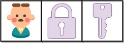

### 获取所有钥匙的最短路径

> 题目: 给定一个二维网格 grid ，其中：

* '.' 代表一个空房间
* '#' 代表一堵墙
* '@' 是起点
* 小写字母代表钥匙
* 大写字母代表锁
* 
我们从起点开始出发，一次移动是指向四个基本方向之一行走一个单位空间。我们不能在网格外面行走，也无法穿过一堵墙。如果途经一个钥匙，我们就把它捡起来。除非我们手里有对应的钥匙，否则无法通过锁。

假设 k 为 钥匙/锁 的个数，且满足 1 <= k <= 6，字母表中的前 k 个字母在网格中都有自己对应的一个小写和一个大写字母。换言之，每个锁有唯一对应的钥匙，每个钥匙也有唯一对应的锁。另外，代表钥匙和锁的字母互为大小写并按字母顺序排列。

返回获取所有钥匙所需要的移动的最少次数。如果无法获取所有钥匙，返回 -1 。


示例 1：


```js
// 输入：grid = ["@.a.#","###.#","b.A.B"]
// 输出：8
// 解释：目标是获得所有钥匙，而不是打开所有锁。
```

示例 2：


```js
// 输入：grid = ["@..aA","..B#.","....b"]
// 输出：6
```

示例 3：



```js
// 输入: grid = ["@Aa"]
// 输出: -1
```

提示:

* m == grid.length
* n == grid[i].length
* 1 <= m, n <= 30
* grid[i][j] 只含有 '.', '#', '@', 'a'-'f' 以及 'A'-'F'
* 钥匙的数目范围是 [1, 6] 
* 每个钥匙都对应一个 不同 的字母
* 每个钥匙正好打开一个对应的锁

### 思路分析

给定一个只包含空房间、墙、起点和终点的二维网格，我们可以使用广度优先搜索的方法求出起点到终点的最短路径。这是因为在最短路径上，我们最多只会经过每个房间一次。因此从起点开始，使用队列进行广度优先搜索，当第一个搜索到某个节点的时候，我们就可以得到从起点到该节点正确的最短路。

如果加上了钥匙和锁，我们应该如何解决问题呢？类似地，在最短路径上也不可能存在如下的情况：我们经过了某个房间两次，并且这两次我们拥有钥匙的情况是完全一致的。

因此，我们可以用一个三元组 (x,y,mask) 表示当前的状态，其中 (x,y) 表示当前所处的位置，mask 是一个二进制数，长度恰好等于网格中钥匙的数目，mask 的第 i 个二进制位为 1，当且仅当我们已经获得了网格中的第 i 把钥匙。

这样一来，我们就可以使用上述的状态进行广度优先搜索。初始时，我们把 (sx,sy,0) 加入队列，其中 (sx,sy) 为起点。在搜索的过程中，我们可以向上下左右四个方向进行扩展：

如果对应方向是空房间，那么 mask 的值不变；

如果对应方向是第 i 把钥匙，那么将 mask 的第 i 位置为 1；

如果对应方向是第 i 把锁，那么只有在 mask 的第 i 位为 1 时，才可以通过。

当我们搜索到一个 mask 每一个二进制都为 11 的状态时，说明获取了所有钥匙，此时就可以返回最短路径作为答案。

这里注意当我们存储状态时，我们需要确定是否存在钥匙，就要考虑使用位运算。

```js
// '.' 代表一个空房间
// '#' 代表一堵墙
// '@' 是起点
// 小写字母代表钥匙
// 大写字母代表锁
var shortestPathAllKeys = function (grid) {
    // 四个方向,左右上下
    const dirs = [
        [-1, 0],
        [1, 0],
        [0, -1],
        [0, 1],
    ];
    // 行与列
    const m = grid.length,
        n = grid[0].length;
    // 存储mask状态值
    const saveIndex = new Map();
    // 当前的位置
    let sx = 0,
        sy = 0;
    for (let i = 0; i < m; i++) {
        for (let j = 0; j < n; j++) {
            // 记录起点
            if (grid[i][j] === "@") {
                sx = i;
                sy = j;
            } else if ("a" <= grid[i][j] && grid[i][j] <= "z") {
                // 记录钥匙所在位置
                if (!saveIndex.has(grid[i][j])) {
                    const idx = saveIndex.size;
                    // 往二进制数的位置添加索引值
                    saveIndex.set(grid[i][j], idx);
                }
            }
        }
    }
    // 定义队列，采用广度优先搜索算法，从队尾中加入元素，从队首中取出元素
    const queue = [],
        //定义一个记录状态的二维数组，由于记录状态本身也是一个一维数组，所以最终就是一个三维数组
        dist = new Array(m).fill(0).map(() => new Array(n).fill(0).map(() => new Array(1 << saveIndex.size).fill(-1)));
    //添加一个起点到队列中
    queue.push([sx, sy, 0]);
    // 起点为0
    dist[sx][sy][0] = 0;
    while (queue.length) {
        const arr = queue.shift();
        const [x, y, mask] = arr;
        // 四个方向上做判断
        for (let i = 0; i < 4; i++) {
            let nx = x + dirs[i][0],
                ny = y + dirs[i][1];
            // 边界判断,如果是墙，不能走，并且只能在二维网格中行走，水平方向上的范围就是0 <= x < m,垂直方向上的范围就是 0 <= y < m
            if (nx >= 0 && nx < m && ny >= 0 && ny < n && grid[nx][ny] !== "#") {
                // 如果是空房间或者是起点，，并且当前记录状态的值是-1（也就是初始化状态，还没有记录状态值的情况）,则记录当前状态
                if (grid[nx][ny] === "." || grid[nx][ny] === "@") {
                    if (dist[nx][ny][mask] === -1) {
                        dist[nx][ny][mask] = dist[x][y][mask] + 1;
                        // 当前状态记录完成，将作为下一个状态的起始点，所以添加到队列中去
                        queue.push([nx, ny, mask]);
                    }
                }
                // 如果是钥匙或者锁
                else if ("a" <= grid[nx][ny] && grid[nx][ny] <= "z") {
                    // 分为两种情况，第一种就是当当前记录的状态值等于了记录mask状态值的大小，则代表已经找到了所有钥匙，直接返回当前记录的状态值
                    //第二种则是还没有找到所有钥匙，此时还需要将当前状态值作为起点添加到队列中去
                    const idx = saveIndex.get(grid[nx][ny]);
                    // 又涉及到了位运算
                    if (dist[nx][ny][mask | (1 << idx)] === -1) {
                        dist[nx][ny][mask | (1 << idx)] = dist[x][y][mask] + 1;
                        // 找到所有钥匙
                        if ((mask | (1 << idx)) === (1 << saveIndex.size) - 1) {
                            return dist[nx][ny][mask | (1 << idx)];
                        }
                        queue.push([nx, ny, mask | (1 << idx)]);
                    }
                } else {
                    // 其他情况，也就是锁
                    const idx = saveIndex.get(grid[nx][ny].toLowerCase());
                    // 如果有钥匙并且当前记录锁的状态值为-1的情况下，当前记录状态加1
                    if ((mask & (1 << idx)) !== 0 && dist[nx][ny][mask] === -1) {
                        dist[nx][ny][mask] = dist[x][y][mask] + 1;
                        queue.push([nx, ny, mask]);
                    }
                }
            }
        }
    }
    return -1;
};
```

以上算法的时间复杂度和空间复杂度分析如下:

* 时间复杂度 O(m * n * 2 ^ k)：其中 m 和 n 是网格的行数和列数，k 是网格中钥匙的数量。
* 空间复杂度 O(m * n * 2 ^ k)。

[更多思路](https://leetcode.cn/problems/shortest-path-to-get-all-keys/solution/huo-qu-suo-you-yao-chi-de-zui-duan-lu-ji-uu5m/)。
