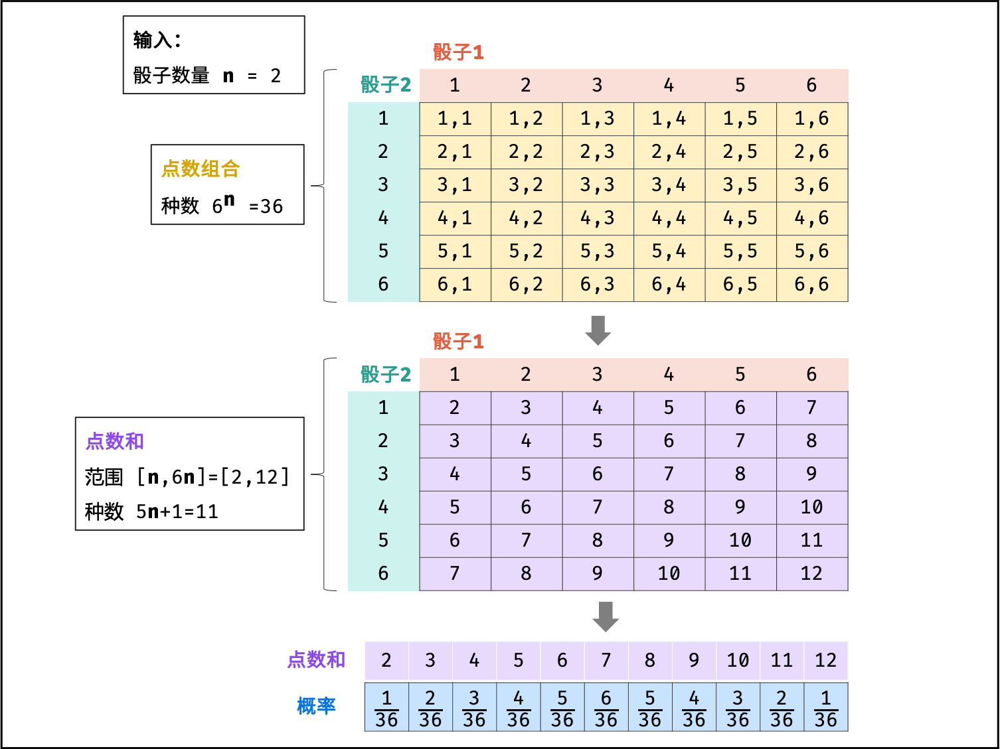
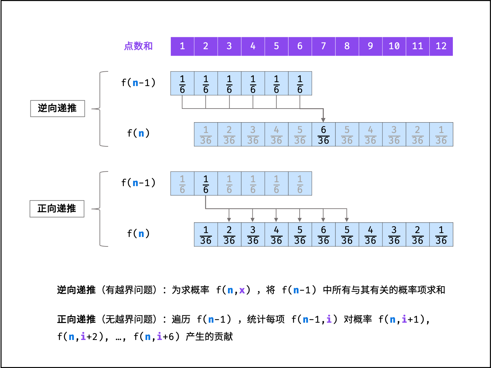

### n个骰子的点数

> 题目:把n个骰子扔在地上，所有骰子朝上一面的点数之和为s。输入n，打印出s的所有可能的值出现的概率。你需要用一个浮点数数组返回答案，其中第 i 个元素代表这 n 个骰子所能掷出的点数集合中第 i 小的那个的概率。

示例 1：

```js
// 输入: 1
// 输出: [0.16667,0.16667,0.16667,0.16667,0.16667,0.16667]
```

示例 2：

```js
// 输入: 2
// 输出: [0.02778,0.05556,0.08333,0.11111,0.13889,0.16667,0.13889,0.11111,0.08333,0.05556,0.02778]
```

限制：

* 1 <= n <= 11


### 思路分析

本题的难度十分的大，因为这考察了组合的知识。在解题之前，我们需要知道一些前置知识。如下:

给定n个骰子（每个骰子为1 ~ 6的点数），即可得:

* 每个骰子摇到1到6的概率相等，因此概率为1 / 6。
* 如果我们将每个骰子的点数看做独立情况，则可以知道`点数组合`为6 ^ n。例如n = 2的时候，点数的组合为:
    (1,1),(1,2),...(2,1),(2,2)...(6,1),(6,2)...
* n个骰子`点数和`的范围为`[n,6n]`,数量为6n - n + 1 = 5n + 1种。

那么现在主要的问题就是如何每个点数和出现的次数，统计每个点数和的次数，我们还是需要找出规律。如下图所示:



不过通过上图可能一时还无法看出规律来，为了找出规律，我们先从最简单的思路入手。如下:

我们可以这样想，求n个骰子的点数和，可以先把n个骰子分成两类，第一类只有1个骰子，另一类为n - 1个骰子。第一类可能会出现1 ~ 6的点数。

因此，我们需要计算从1到6的每一种点数和剩下n - 1个骰子来计算点数和。接下来再把n - 1个骰子又分成两类，同样的也是第一类为1个骰子，那么第二类就应该是n - 2个骰子。然后我们再把上一轮的第一类的1个骰子与这一轮的第一类的1个骰子点数相加，接着再和n - 2个骰子计算点数和......

分析到了这里，我们不难发现，这是一种递归的思路，而递归结束的条件当然就是只剩下最后一个骰子，即n = 1。因此我们可以定义一个5n + 1长度的数组，然后将和为s的点数保存到第s - n个元素中。代码如下:

```js
/**
 * @param {number} n
 * @return {number[]}
 */
// 我们可以定义一个常量来表示骰子的最大点数，方便扩展。
const maxValue = 6;
var dicesProbability = function(n) {
    // n 小于1是边界条件
    if(n < 1){
        return [];
    }
    // 点数和的最大值
    let maxSum = maxValue * n,
        res = new Array(maxSum - n + 1), //存储每一种点数和，即点数和出现的种数
        ratio = [];
    // 初始化点数和出现次数，为0
    for(let i = n;i <= maxSum;i++){
        res[i - n] = 0;
    }
    // 保存点数和
    helper(n,res);
    // 定义总数
    let total = Math.pow(6,n);
    // 计算概率
    for(let i = n;i <= maxSum;i++){
        // 点数和为[n,6n],res代表统计骰子出现的次数
        ratio.push(res[i - n] / total);
    }
    return res;
};
var helper = function(n,res){
    // 对骰子进行拆分，这里是第一个骰子
    for(let i = 1;i <= maxValue;i++){
        // 注意这里的2个n，一个代表n的初始值，一个代表当前n的值，是不一样的，
        // 第二个n就是用来终止递归的
        // 前面分析了每一个骰子的点数和相加
        computedSum(n,n,i,res);
    }
}
// n - 1个骰子
var computedSum = function(origin,current,sum,res){
    // 当骰子只剩一个时，终止递归
    if(current === 1){
        res[sum - origin]++;
    }else{
        for(let i = 1;i <= maxValue;i++){
            computedSum(origin,current - 1,i + sum,res);
        }
    }
}
```

可以看到使用递归做了很多重复工作，时间复杂度非常高，为O(6 ^ n)。为此我们可以考虑一下其它算法的实现，既然可以使用递归来实现，那么同样我们也可以使用循环来实现。为此，我们可以考虑使用两个数组来存储骰子点数每一个总数出现的次数。首先在一次循环中，第一个数组的第n个数字表示骰子和为n出现的次数。在下一轮循环中，我们加上一个新的骰子，此时和为n的骰子出现的次数应该等于上一次循环中骰子点数和为(n - 1,n - 2,n - 3,n - 4,n - 5,n - 6)的次数的总和。所以我们把另一个数字设为前一个数组对应的第(n - 1,n - 2,n - 3,n - 4,n - 5,n - 6)之和。基于这个思路，我们可以写出如下代码:

```js
/**
 * @param {number} n
 * @return {number[]}
 */
const maxValue = 6;
var dicesProbability = function(n) {
    // n 小于1是边界条件
    if(n < 1){
        return [];
    }
    // 用两个数组存储骰子点数出现的次数,用矩阵来表示
    let sumArr = [
        [],
        []
    ];
    // 以下代码无效
    // let sumArr = [];
    // sumArr[0] = sumArr[1] = new Array(maxValue * n + 1);
    const ratio = [];
    // 初始化
    for(let i = 0;i < maxValue * n + 1;i++){
        sumArr[0][i] = 0;
        sumArr[1][i] = 0;
    }
    // 定义一个用于交换的辅助变量，初始为0
    let temp = 0;
    // 初始化第一个骰子的出现次数，为1
    for(let i = 1;i <= maxValue;i++){
        sumArr[temp][i] = 1;
    }
    // 初始化第n个数字
    for(let j = 2;j <= n;j++){
        for(let k = 0;k < j;k++){
            sumArr[1 - temp][k] = 0;
        }
        for(let m = j;m <= maxValue * j;m++){
            sumArr[1 - temp][m] = 0;
            for(let l = 1;l <= m && l <= maxValue;l++){
                sumArr[1 - temp][m] += sumArr[temp][m - l];
            }
        }
        temp = 1 - temp;
    }
    // 定义总数
    let total = Math.pow(6,n);
    for(let i = n;i <= maxValue * n;++i){
        ratio.push(sumArr[temp][i] / total);
    }
    delete sumArr[0];
    delete sumArr[1];
    return ratio;
};
```

关于循环实现的思路确实不太好理解，需要多熟读几遍便能领会其中的巧妙。接下来，我们来讨论另一种算法，那就是动态规划的实现。

> 设输入n个骰子的解（即概率列表）为f(n),其中`[点数和]`x的概率为f(n,x)。

假设已知n - 1个骰子的解f(n - 1)，此时再添加一个骰子，求n个骰子的点数和为x的概率f(n,x)。当添加骰子的点数为1时，前n - 1个骰子的点数和应为x - 1，方可组成点数和x；同理，当此骰子的点数为2时，前n - 1个骰子因为x - 2；以此类推，直到此骰子的点数为6。将这6种情况的概率相加，即可得到概率f(n,x)。递推公式如下图所示:


根据以上的分析，我们可以通过子问题的解f(n - 1)可递推计算出f(n),而输入一个骰子的解f(1)已知，因此可以通过解f(1)依次递推出任意解f(n)（本质上和递归思路差不多。）。

> 如下图所示: 为n = 2,x = 7的递推计算示例。


观察发现，以上递推公式虽然可行，但是f(n - 1,x - i)中的x - i会有越界问题。例如，若希望递推f(2,2)，由于一个骰子的点数和范围为`[1,6]`,因此只需要求f(1,1)的和，即f(1,0),f(1,-1),...f(1,-4)皆无意义。此越界问题导致编码的难度提升。

> 如下图所示，由于以上递推公式"逆向"的，即为了计算f(n,x)，将所有与之有关的情况求和；而倘若改成"正向"的递推公式，便可解决越界问题。



具体来看，由于新增骰子的点数只可能为1到6，因此概率f(n - 1,x)仅与f(n,x + 1),f(n, x + 2)...f(n,x + 6)相关。因此，遍历f(n - 1)中各点数和的概率，并将其相加至f(n)中所有的相关项，即可完成f(n - 1)到f(n)的递推。现在，我们将f(i)记为动态规划列表形式dp[i]。即可写出如下代码:

```js
/**
 * @param {number} n
 * @return {number[]}
 */
var dicesProbability = function(n) {
    let ratio = [];
    // 初始化1 / 6
    for(let i = 0;i < 6;i++){
        ratio.push(1 / 6);
    }
    for(let i = 2;i <= n;i++){
        const temp = [];
        for(let j = 0;j < 5 * i + 1;j++){
            temp.push(0);
        }
        for(let k = 0;k < ratio.length;k++){
            for(let l = 0;l < 6;l++){
                temp[k + l] += ratio[k] / 6;
            }
        }
        ratio = temp;
    }
    return ratio;
};
```

时间复杂度 O(n ^ 2)： 状态转移循环 n - 1轮；每轮中，当 i = 2, 3, ..., n时，对应循环数量分别为 6 * 6, 11 * 6, ..., [5(n - 1) + 1] * 6；因此总体复杂度为 O((n - 1) * (6 + (5 * (n - 1) + 1)) / 2 * 6) ，即等价于 O(n ^ 2)。
空间复杂度 O(n)： 状态转移过程中，辅助数组 temp 最大长度为 6(n-1) - [(n-1) - 1] = 5n - 4 ，因此使用 O(5n - 4) = O(n)大小的额外空间。

更多详细解题思路参考[题解](https://leetcode-cn.com/problems/nge-tou-zi-de-dian-shu-lcof/solution/jian-zhi-offer-60-n-ge-tou-zi-de-dian-sh-z36d/)。

