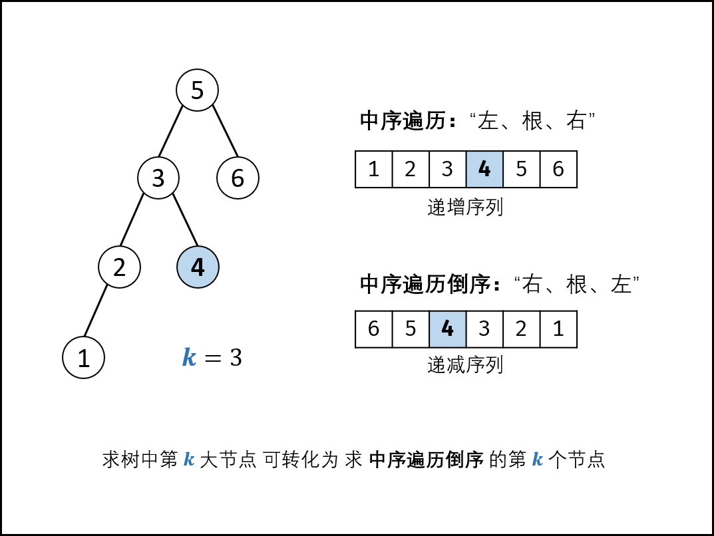

### 二叉搜索树的第k大节点

> 题目:给定一棵二叉搜索树，请找出其中第k大的节点。

示例1:

```js
// 输入: root = [3,1,4,null,2], k = 1
//    3
//   / \
//  1   4
//   \
//    2
// 输出: 4
```

示例2:


```js
// 输入: root = [5,3,6,2,4,null,null,1], k = 3
//        5
//       / \
//      3   6
//     / \
//    2   4
//   /
//  1
// 输出: 4
```

限制:

* 1 ≤ k ≤ 二叉搜索树元素个数

### 思路分析

解答本题之前需要记住一条性质:那就是二叉树的中序遍历是递增序列。

* 根据以上性质，可以知道二叉树的中序遍历的倒序即递减序列。
* 因此，本题可以转化为求此树的中序遍历的倒序的第k个节点。



中序遍历为:左->根->右，递归代码如下:

```js
function DFS(node){
    if(node === null){
        return null;
    }
    DFS(node.left);
    console.log(node.val);
    DFS(node.right);
}
```

中序遍历的倒序为:右->根->左，递归代码如下:

```js
function DFS(node){
    if(node === null){
        return null;
    }
    DFS(node.right);
    console.log(node.val);
    DFS(node.left);
}
```

* 为求第k个节点，需要做以下的工作:
    1. 递归遍历时计数，统计当前节点的序号。
    2. 递归到第k个节点时，应记录结果res。
    3. 记录结果之后，后续的遍历就失去了意义，应提前终止(返回)。

递归解析如下:

1. 终止条件: 当节点node为空时(越过叶节点)，则直接返回。
2. 递归右子树: DFS(node.right)。
3. 三项工作:
   3.1 提前返回:若k = 0，代表已经找到目标节点，因此无需继续遍历，直接返回即可。
   3.2 统计序号，执行k = k - 1，即从k减到0。
   3.3 记录结果：若k = 0，则代表当前节点为第k大的节点，因此记录res = node.val。

4. 递归左子树:即DFS(node.left)。

> 说明:题目已经指出了1 <= k <= N。因此无需考虑k > N的情况。如果要考虑的话，则只需要在中序遍历完成之后判断k > 0是否成立，如果成立则说明K > N。

```js
/**
 * Definition for a binary tree node.
 * function TreeNode(val) {
 *     this.val = val;
 *     this.left = this.right = null;
 * }
 */
/**
 * @param {TreeNode} root
 * @param {number} k
 * @return {number}
 */
var kthLargest = function(root, k) {
    this.k = k;
    let res = null;
    function DFS(node){
        if(node === null){
            return null;
        }
        DFS(node.right)。
        if(k === 0){
            return null;
        }
        if(--this.k === 0){
            res = node.val;
        }
        DFS(node.left);
    }
    DFS(root);
    return res;
};
```

时间复杂度 O(n)： 当树退化为链表时（全部为右子节点），无论 k 的值大小，递归深度都为n，占用O(n)时间。
空间复杂度 O(n)： 当树退化为链表时（全部为右子节点），系统使用O(n)大小的栈空间。


更多详细解题思路参考[题解](https://leetcode-cn.com/problems/er-cha-sou-suo-shu-de-di-kda-jie-dian-lcof/solution/mian-shi-ti-54-er-cha-sou-suo-shu-de-di-k-da-jie-d/)。

