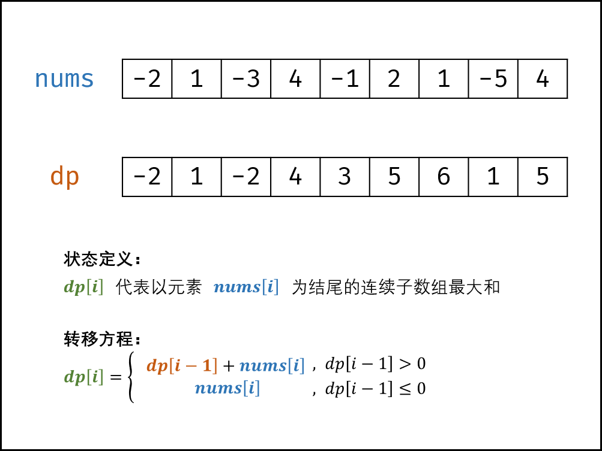

### 连续子数组的最大和

> 题目:输入一个整型数组，数组中的一个或连续多个整数组成一个子数组。求所有子数组的和的最大值。要求时间复杂度为O(n)。

示例 1：

```js
// 输入: nums = [-2,1,-3,4,-1,2,1,-5,4]
// 输出: 6
// 解释: 连续子数组 [4,-1,2,1] 的和最大，为 6。
```

提示：

* 1 <= arr.length <= 10^5
* -100 <= arr[i] <= 100

### 思路分析

本题使用动态规划来解决是最简单的。按照动态规划的思想，我们设有动态规划列表dp,dp[i]代表以元素nums[i]为结尾的连续子数组的最大和。为什么我们需要定义最大和dp[i]包含元素nums[i]呢?我们是为了确保dp[i]递推到dp[i+1]的正确性，如果不包含dp[i]，递推时则不会满足题目的连续子数组的最大和需求。

第二步，找到状态转移方程，我们需要先判断如果dp[i-1]<=0的话，说明dp[i-1] + nums[i]还不如nums[i]本身大。因此状态转移方程包含两种情况：

1. dp[i - 1] <= 0时,dp[i] = nums[i]。
2. dp[i - 1] > 0时,dp[i] = dp[i - 1] + nums[i]。

第三步，定义初始状态dp[0] = nums[0]。第四步，最后得到的dp列表中的最大值就是最终的结果。如下图所示:



当然，这里我们还可以优化。因为dp[i]只与dp[i - 1]和nums[i]有关，所以我们可以直接令动态规划列表为原数组，也就是直接操作原数组即可。这样空间复杂度也就降到了O(1)。

```js
var maxSubArray = function (nums) {
    //定义初始状态
    let dpFirst = nums[0];
    for(let i = 0,len = nums.length;i < len;i++){
        //nums[i - 1] <= 0的时候只需要加0才能保证自身不变>
        nums[i] += Math.max(nums[i - 1],0);
        //nums[i]与dpFirst之间取最大值
        dpFirst = Math.max(nums[i],dpFirst);
    }
    return dpFirst;
};
```

以上算法，时间复杂度是O(n),空间复杂度是O(1)。更多详细解题思路参考[题解](https://leetcode-cn.com/problems/lian-xu-zi-shu-zu-de-zui-da-he-lcof/solution/lian-xu-zi-shu-zu-de-zui-da-he-by-leetco-tiui/)。


