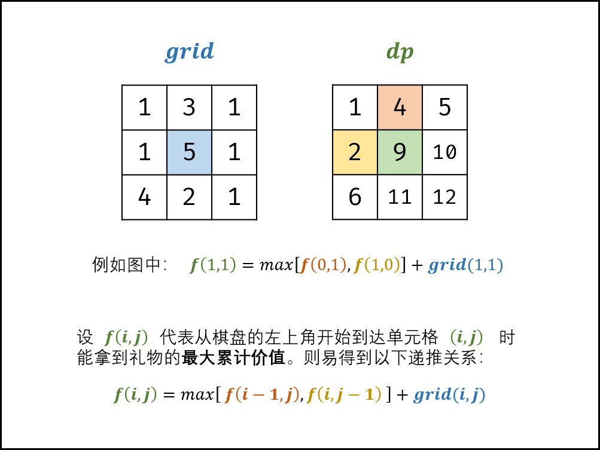

### 礼物的最大价值

> 题目: 在一个 m*n 的棋盘的每一格都放有一个礼物，每个礼物都有一定的价值（价值大于 0）。你可以从棋盘的左上角开始拿格子里的礼物，并每次向右或者向下移动一格、直到到达棋盘的右下角。给定一个棋盘及其上面的礼物的价值，请计算你最多能拿到多少价值的礼物？


示例 1：

```js
// 输入: 
// [
//   [1,3,1],
//   [1,5,1],
//   [4,2,1]
// ]
// 输出: 12
// 解释: 路径 1→3→5→2→1 可以拿到最多价值的礼物
```

 
> 提示:

* 0 < grid.length <= 200
* 0 < grid[0].length <= 200

### 思路分析

根据题意我们可以明白:从棋盘的左上角开始拿格子里的礼物，并且每次`向右`或者`向下`移动一格，直到到达棋盘的右下角。因此，某单元格只可能从最上边单元格或者最左边单元格到达右下角。

设f(i,j) 为棋盘左上角走至单元格(i,j)的礼物最大价值，因此可以得到一个递推关系:f(i,j)等于f(i,j - 1)和f(i - 1,j)中的最大值加上当前礼物的价值grid(i,j)。公式如下:

```js
f(i,j) = max(f(i,j - 1),f(i - 1,j)) + grid(i,j);
```

因此，本题可以使用动态规划的算法思想来解决。以上公式便是转移方程。



动态规划解析如下:

* 状态定义:设动态规划矩阵dp,dp(i,j)代表从棋盘的左上角开始，到达单元格(i,j)时能拿到礼物的最大价值。
* 转移方程:
    * 当i = 0,j = 0时，为起始元素。
    * 当i = 0,j != 0时，只可从左边到达。
    * 当i != 0,j = 0时，只可从上边到达。
    * 当i != 0,j != 0时，可从左边或者上边到达。

* 初始状态: dp[0][0] = grid[0][0]，即到达单元格(0,0)的礼物最大价值为grid[0][0];
* 返回值: 返回dp[m - 1][n - 1],其中m为矩阵的行高,n为矩阵的列宽，即返回矩阵的右下角元素。

本题还可以进一步优化空间复杂度。

* 由于dp[i][j]只与dp[i - 1][j],dp[i][j - 1],grid[i][j]有关系，因此可以将原矩阵用作动态规划的dp矩阵,即直接在原grid上修改即可。
* 应用此方法可以将原本空间复杂度O(m * n)降到了O(1)。

```js
/**
 * @param {number[][]} grid
 * @return {number}
 */
var maxValue  = function(grid) {
    let m = grid.length,n = grid[0].length;
    // 初始化第一行
    for(let i = 1;i < m;i++){
        grid[i][0] += grid[i - 1][0];
    }
    // 初始化第一列
    for(let j = 1;j < n;j++){
        grid[0][j] += grid[0][j - 1];
    }
    for(let i = 1;i < m;i++){
        for(let j = 1;j < n;j++){
            grid[i][j] += Math.max(grid[i][j - 1],grid[i - 1][j]);
        }
    }
    return grid[m - 1][n - 1];
};
```

* 时间复杂度 O(m * n) ： m,n 分别为矩阵行高、列宽；动态规划需遍历整个 grid 矩阵，使用 O(m * n) 时间。
* 空间复杂度 O(1) ： 原地修改使用常数大小的额外空间。

[更多思路](https://leetcode-cn.com/problems/li-wu-de-zui-da-jie-zhi-lcof/solution/mian-shi-ti-47-li-wu-de-zui-da-jie-zhi-dong-tai-gu/)。

