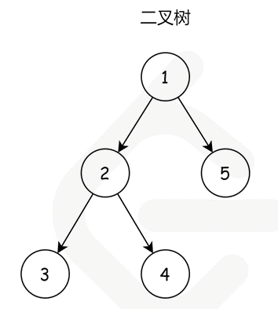

### 序列化二叉树

> 题目:请实现两个函数，分别用来序列化和反序列化二叉树。

你需要设计一个算法来实现二叉树的序列化与反序列化。这里不限定你的序列 / 反序列化算法执行逻辑，你只需要保证一个二叉树可以被序列化为一个字符串并且将这个字符串反序列化为原始的树结构。

提示：输入输出格式与 LeetCode 目前使用的方式一致，详情请参阅[LeetCode序列化二叉树](https://support.leetcode-cn.com/hc/kb/article/1194353/)的格式。你并非必须采取这种方式，你也可以采用其他的方法解决这个问题。

示例:


输入：root = [1,2,3,null,null,4,5]
输出：[1,2,3,null,null,4,5]

### 思路分析

二叉树的序列化本质上还是对其值进行编码，更重要的是对其结构进行编码（我把编码理解为标记索引值）。因此我们可以直接遍历二叉树就可以完成本题的解法。那么如何遍历呢?

我们知道遍历二叉树通常有2种策略:即广度优先搜索和深度优先搜索。

1. 广度优先搜索就是从上到下按照层次性的遍历所有的节点。
2. 深度优先搜索则是从一个根节点开始，然后一直延伸到叶子节点，然后再回到根节点，然后再到下一个分支的叶子节点。根据根节点、左节点以及右节点的顺序关系，进一步可将深度优先搜索策略分成如下三种:

2.1 先序遍历(前序遍历)
2.2 中序遍历
2.3 后序遍历

这里，我们采用先序遍历的方式，即根->左->右。如图所示:



我们先从根节点`1`开始，然后到根节点`1`的左子树的根节点`2`,我们以`","`来确定每一个节点的分隔符号，所以这里我们的节点字符串就应该变成了`1,2,`。然后，我们再从根节点`2`开始，访问它的左子树和右子树节点，即左子树`1,2,3,null,null`。`3`的左节点和右节点为空，所以我们以`null`表示，这也就是我们在序列化树的结构期间所保存树结构的一种方式。左子树访问完之后，再访问右子树,得到节点字符串为`1,2,3,null,null,4,null,null`。最后，我们回到根节点`1`并访问它的右子树，恰好就是叶节点`5`,最后序列化出来的字符串就是`1,2,3,null,null,4,null,null,5,null,null`。

也就是说，我们先序遍历这棵二叉树，遇到空子树的时候转换成空值`null`,否则就递归继续序列化。如此，我们就完成了序列化二叉树的过程。那么我们应该如何反序列化呢？
首先我们需要根据我们的分隔符号`","`来将原先序列化的字符串转化成序列化的先序遍历得到的节点列表。然后从左向右遍历这个节点列表即可。

1. 如果这个元素的值是null,则代表是一棵空树。
2. 先解析左子树然后再解析右子树。

```js
/**
 * Definition for a binary tree node.
 * function TreeNode(val) {
 *     this.val = val;
 *     this.left = this.right = null;
 * }
 */

/**
 * Encodes a tree to a single string.
 *
 * @param {TreeNode} root
 * @return {string}
 */
var serialize = function(root) {
    //定义一个序列化函数,参数为序列化的节点和最后返回的序列化的字符串
    return serializeHandler(root,"")
};
var serializeHandler = function(root,str){
    //判断如果节点是null,则添加null的值
    if(!root){
        str += "null,";
    }else{
        //按,拼接字符串
        str += root.val + " " + ",";
        //先递归遍历左子树
        str = serializeHandler(root.left,str);
        //再递归遍历右子树
        str = serializeHandler(root.right,str);
    }
    //返回序列化的字符串
    return str;
}
/**
 * Decodes your encoded data to tree.
 *
 * @param {string} data
 * @return {TreeNode}
 */
var deserialize = function(data) {
    //定义一个反序列化的函数，参数是需要反序列化的先序遍历的节点列表
    let dataList = data.split(",");
    return deserializeHandler(dataList);
};

var deserializeHandler = function(list){
    //如果第一个值就是null,则代表就是一棵空树，从节点列表中按照从左到右的顺序删除，并直接返回null即可
    //shift方法即是从左到右的删除
    if(list[0] === "null"){
        list.shift();
        return null;
    }
    //构建树节点,这里由于节点值是字符串，所以需要先转成数值
    const root = new TreeNode(parseInt(list[0]));
    //构建了之后，从左到右从节点列表中删除
    list.shift();
    //先递归左子树
    root.left = deserializeHandler(list);
    //在递归右子树
    root.right = deserializeHandler(list);

    //返回构建的树节点
    return root;
}
/**
 * Your functions will be called as such:
 * deserialize(serialize(root));
 */
```

时间复杂度：在序列化和反序列化函数中，我们只访问每个节点一次，因此时间复杂度为 O(n)，其中 n 是节点数，即树的大小。
空间复杂度：在序列化和反序列化函数中，我们递归会使用栈空间，故渐进空间复杂度为 O(n)。
更多详细解题思路参考[题解](https://leetcode-cn.com/problems/xu-lie-hua-er-cha-shu-lcof/solution/xu-lie-hua-er-cha-shu-by-leetcode-soluti-4duq/)。

