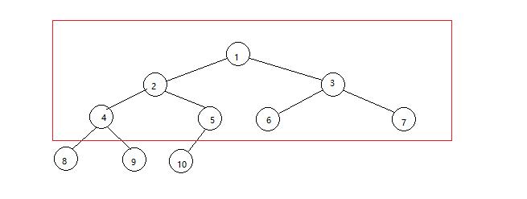

###  往完全二叉树添加节点

> 题目:完全二叉树是每一层（除最后一层外）都是完全填充（即，节点数达到最大，第 n 层有 2n-1 个节点）的，并且所有的节点都尽可能地集中在左侧。

设计一个用完全二叉树初始化的数据结构 CBTInserter，它支持以下几种操作：

* CBTInserter(TreeNode root) 使用根节点为 root 的给定树初始化该数据结构；
* CBTInserter.insert(int v)  向树中插入一个新节点，节点类型为 TreeNode，值为 v 。使树保持完全二叉树的状态，并返回插入的新节点的父节点的值；
* CBTInserter.get_root() 将返回树的根节点。

示例1：

```js
// 输入：inputs = ["CBTInserter","insert","get_root"], inputs = [[[1]],[2],[]]
// 输出：[null,1,[1,2]]
```

示例2：

```js
// 输入：inputs = ["CBTInserter","insert","insert","get_root"], inputs = [[[1,2,3,4,5,6]],[7],[8],[]]
// 输出：[null,3,4,[1,2,3,4,5,6,7,8]]
```

提示:

* 最初给定的树是完全二叉树，且包含 1 到 1000 个节点。
* 每个测试用例最多调用 CBTInserter.insert  操作 10000 次。
* 给定节点或插入节点的每个值都在 0 到 5000 之间。


> 注意：本题与[主站 919 题](https://leetcode-cn.com/problems/complete-binary-tree-inserter/)相同。

### 思路分析

本题的难点在于如何理解什么是完全二叉树。如下图所示:



这就是一个完全二叉树，也就是说除了最后一层的节点，其余每层的节点都是填充满了的。理解了完全二叉树之后，我们再来解答本题。根据题意，我们可以理解为只要找到第一个需要被插入的节点，判断它如果没有左子节点，就将当前节点添加到左子节点中，如果没有右子节点，那么就添加到右子节点中。所以我们可以写一个队列，找到需要插入节点的元素。然后到这里，我们就可以有两种方式来实现，第一种就是在初始化队列的时候，就把根节点添加到队列中，然后根据根节点，依次插入根节点的左右子节点，然后就可以判断是否在该节点下插入新节点，一旦有左右子节点的节点就可以从队列中移除，避免下一次插入的时候又去做判断，也为了节省空间。第二种则是初始化时只把根节点插入到队列中，只有在执行插入操作的时候才去整理队列中的元素。下面代码是采用第二种方式来实现的。

```js
/**
 * Definition for a binary tree node.
 * function TreeNode(val, left, right) {
 *     this.val = (val===undefined ? 0 : val)
 *     this.left = (left===undefined ? null : left)
 *     this.right = (right===undefined ? null : right)
 * }
 */
/**
 * @param {TreeNode} root
 */
var CBTInserter = function(root) {
    //存取根节点
    this.root = root;
    //初始化队列，只存储根节点
    this.queue = [root];
};

/** 
 * @param {number} v
 * @return {number}
 */
CBTInserter.prototype.insert = function(v) {
    let node = new TreeNode(v);
    //队列的根节点有左右子节点，则添加到队列中去，然后删除根节点
    while(this.queue[0].left && this.queue[0].right){
        this.queue[0].push(this.queue[0].left,this.queue[0].right);
        this.queue.shift();
    }
    //判断当前节点是左子节点没有还是右子节点没有，添加节点
    this.queue[0].left ? (this.queue[0].right = node) : (this.queue[0].left);
    return this.queue[0].val;
};

/**
 * @return {TreeNode}
 */
CBTInserter.prototype.get_root = function() {
    return this.root;
};

/**
 * Your CBTInserter object will be instantiated and called as such:
 * var obj = new CBTInserter(root)
 * var param_1 = obj.insert(v)
 * var param_2 = obj.get_root()
 */
```

以上算法的时间复杂度和空间复杂度分析如下:

* 时间复杂度：O(n)。
* 空间复杂度：O(n)。

[更多思路](https://leetcode-cn.com/problems/NaqhDT/solution/jian-zhi-offer-2-mian-shi-ti-43-shu-zhon-hy4v/)。
