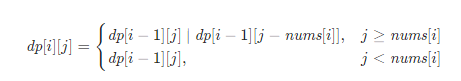

###  分割等和子集
 
> 题目:给定一个非空的正整数数组 nums ，请判断能否将这些数字分成元素和相等的两部分。

示例1：

```js
// 输入：nums = [1,5,11,5]
// 输出：true
// 解释：nums 可以分割成 [1, 5, 5] 和 [11] 。
```


示例2：

```js
// 输入：nums = [1,2,3,5]
// 输出：false
// 解释：nums 不可以分为和相等的两部分
```

提示:

* 1 <= nums.length <= 200
* 1 <= nums[i] <= 100

> 注意：本题与[主站 416 题](https://leetcode-cn.com/problems/partition-equal-subset-sum/)相同。

### 思路分析

本题是经典的「[NP 完全问题](https://baike.baidu.com/item/NP完全问题)」，也就是说，如果你发现了该问题的一个[多项式算法](https://baike.baidu.com/item/多项式算法)，那么恭喜你证明出了 P=NP，可以期待一下图灵奖了。

正因如此，我们不应期望该问题有多项式时间复杂度的解法。我们能想到的，例如基于贪心算法的「将数组降序排序后，依次将每个元素添加至当前元素和较小的子集中」之类的方法都是错误的，可以轻松地举出反例。因此，我们必须尝试非多项式时间复杂度的算法，例如时间复杂度与元素大小相关的动态规划。

这道题可以换一种表述：给定一个只包含正整数的非空数组 nums[0]，判断是否可以从数组中选出一些数字，使得这些数字的和等于整个数组的元素和的一半。因此这个问题可以转换成「0-1 背包问题」。这道题与传统的「0-1 背包问题」的区别在于，传统的「0-1 背包问题」要求选取的物品的重量之和不能超过背包的总容量，这道题则要求选取的数字的和恰好等于整个数组的元素和的一半。类似于传统的「0-1 背包问题」，可以使用动态规划求解。

在使用动态规划求解之前，首先需要进行以下判断。

* 根据数组的长度 n 判断数组是否可以被划分。如果 n < 2，则不可能将数组分割成元素和相等的两个子集，因此直接返回false。

* 计算整个数组的元素和 sum 以及最大元素 maxNum。如果 sum 是奇数，则不可能将数组分割成元素和相等的两个子集，因此直接返回false。如果sum 是偶数，则令target = sum / 2，需要判断是否可以从数组中选出一些数字，使得这些数字的和等于target。如果maxNum > target，则除了maxNum 以外的所有元素之和一定小于target，因此不可能将数组分割成元素和相等的两个子集，直接返回false。

创建二维数组dp,包含n行target + 1列，其中dp[i][j]表示从数组的[0,i]下标范围内选取若干个整数(也可以是0个)，是否存在选取方案使得被选取的正整数的和等于j。初始时,dp中的全部元素都是false。

在定义状态之后，需要考虑边界情况，以下两种情况都属于边界情况。

* 如果不选取任何正整数，则被选取的正整数一定是0，因此对于所有的0 <= i < n,都有dp[i][0] = true。
* 当i = 0时，只有一个正整数nums[0]可以被选取，因此dp[0][nums[0]] = true。

对于 i > 0 且 j > 0 的情况，如何确定 dp[i][j] 的值？需要分别考虑以下两种情况。

* 如果j ≥ nums[i]，则对于当前的数字nums[i]，可以选取也可以不选取，两种情况只要有一个为true，就有dp[i][j] = true。

    * 如果不选取nums[i]，则dp[i][j] = dp[i−1][j]；
    * 如果选取nums[i]，则dp[i][j] = dp[i−1][j − nums[i]]。

* 如果j < nums[i]，则在选取的数字的和等于 j 的情况下无法选取当前的数字nums[i]，因此有dp[i][j] = dp[i−1][j]。

状态转移方程如下：



最终得到dp[n−1][target] 即为答案。

```js
/**
 * @param {number[]} nums
 * @return {boolean}
 */
var canPartition = function(nums) {
    const n = nums.length;
    if(n < 2){
        return false;
    }
    let sum = 0,maxNum = 0;
    for(const num of nums){
        sum += num;
        maxNum = Math.max(maxNum,num);
    }
    // 判断sum是否是奇数
    if(sum & 1){
        return false;
    }
    const target = Math.floor(sum / 2);
    if(maxNum > target){
        return false;
    }
    const dp = new Array(n).fill(false).map(() => new Array(target + 1).fill(false));
    for(let i = 0;i < n;i++){
        dp[i][0] = true;
    }
    dp[0][nums[0]] = true;
    for(let i = 1;i < n;i++){
        const num = nums[i];
        for(let j = 1;j <= target;j++){
            if(j >= num){
                dp[i][j] = dp[i - 1][j] | dp[i - 1][j - num];
            }else{
                dp[i][j] = dp[i - 1][j];
            }
        }
    }
    return dp[n - 1][target];
};
```

以上算法的时间复杂度和空间复杂度分析如下:

* 时间复杂度：O(n * target)，其中 n 是数组的长度，target 是整个数组的元素和的一半。需要计算出所有的状态，每个状态在进行转移时的时间复杂度为 O(1)。
* 空间复杂度：O(n * target)，其中 target 是整个数组的元素和的一半，n是数组的长度。空间复杂度取决于dp 数组，在不进行空间优化的情况下，空间复杂度是O(n * target)。

上述代码的空间复杂度是O(n * target)。但是可以发现在计算dp 的过程中，每一行的dp值都只与上一行的dp值有关，因此只需要一个一维数组即可将空间复杂度降到O(target)。此时的转移方程为：

dp[j] = dp[j] | dp[j − nums[i]]

且需要注意的是第二层的循环我们需要从大到小计算，因为如果我们从小到大更新dp值，那么在计算dp[j]值的时候dp[j − nums[i]] 已经是被更新过的状态，不再是上一行的dp值。

```js
/**
 * @param {number[]} nums
 * @return {boolean}
 */
var canPartition = function(nums) {
    const n = nums.length;
    if(n < 2){
        return false;
    }
    let sum = 0,maxNum = 0;
    for(const num of nums){
        sum += num;
        maxNum = Math.max(maxNum,num);
    }
    // 判断sum是否是奇数
    if(sum & 1){
        return false;
    }
    const target = Math.floor(sum / 2);
    if(maxNum > target){
        return false;
    }
    const dp = new Array(target + 1).fill(false);
    dp[0] = true;
    for(const num of nums){
        for(let j =  target;j >= num;j--){
            dp[j] |= dp[j -  num];
        }
    }
    return dp[target];
};
```

以上算法的时间复杂度和空间复杂度分析如下:

* 时间复杂度：O(n * target)，其中 n 是数组的长度，target 是整个数组的元素和的一半。需要计算出所有的状态，每个状态在进行转移时的时间复杂度为 O(1)。
* 空间复杂度：O(target)，其中 target 是整个数组的元素和的一半。

[更多思路](https://leetcode-cn.com/problems/NUPfPr/solution/fen-ge-deng-he-zi-ji-by-leetcode-solutio-re1t/)。
