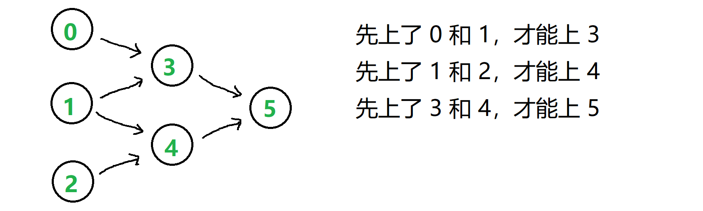

###  课程顺序
 
> 题目:现在总共有 numCourses 门课需要选，记为 0 到 numCourses-1。

给定一个数组 prerequisites ，它的每一个元素 prerequisites[i] 表示两门课程之间的先修顺序。 例如 prerequisites[i] = [ai, bi] 表示想要学习课程 ai ，需要先完成课程 bi 。

请根据给出的总课程数  numCourses 和表示先修顺序的 prerequisites 得出一个可行的修课序列。

可能会有多个正确的顺序，只要任意返回一种就可以了。如果不可能完成所有课程，返回一个空数组。

示例1：

```js
// 输入: numCourses = 2, prerequisites = [[1,0]] 
// 输出: [0,1]
// 解释: 总共有 2 门课程。要学习课程 1，你需要先完成课程 0。因此，正确的课程顺序为 [0,1] 。
```

示例2：

```js
// 输入: numCourses = 4, prerequisites = [[1,0],[2,0],[3,1],[3,2]]
// 输出: [0,1,2,3] or [0,2,1,3]
// 解释: 总共有 4 门课程。要学习课程 3，你应该先完成课程 1 和课程 2。并且课程 1 和课程 2 都应该排在课程 0 之后。
//  因此，一个正确的课程顺序是 [0,1,2,3] 。另一个正确的排序是 [0,2,1,3] 。
```

示例3：

```js
// 输入: numCourses = 1, prerequisites = [] 
// 输出: [0]
// 解释: 总共 1 门课，直接修第一门课就可。
```

提示:

* 1 <= numCourses <= 2000
* 0 <= prerequisites.length <= numCourses * (numCourses - 1)
* prerequisites[i].length == 2
* 0 <= ai, bi < numCourses
* ai != bi
* prerequisites 中不存在重复元素

> 注意：本题与[主站 210 题](https://leetcode-cn.com/problems/course-schedule-ii/)相同。

### 思路分析

一共有n门课要上，编号为0 ~ n - 1,先决条件[1,0]，代表必须先上了课0，才能上课1，给定一个n和一个先决条件表，判断完成课程的顺序。根据题意，我们可以建立有向图来描述依赖关系，例如当n = 6,先决条件表为[ [3, 0], [3, 1], [4, 1], [4, 2], [5, 3], [5, 4] ],通过先决条件表，我们可以得知0,1,2没有先修课，可以先选，其余的都要先学习两门课，如果用有向图来描述这种依赖关系（做事的先后顺序），如下图所示:



把这样一个有向无环图变成线性的排序就叫拓扑排序。在有向图当中有入度和出度的概念，即如果存在一条有向边A -> B,则这条边给A增加了一个出度，给B增加了一个入度。因此以上的有向图中，0,1,2的入度为0,3,4,5的入度为2（数边数即可）。我们最开始应该先选入度为0的课，因为它不依赖别的课，例如假设选了0，导致依赖0的课的入度减小，课3的入度就从2变成了1，接着选1，导致课3的入度变成了0，课4的入度变成了1，接着选2，导致课4的入度变成了0，当前课3和课4的入度为0，继续选入度为0的课，直到选不到入度为0的课为止。可以看到这有点类似树的BFS，起初让入度为0的课入列，然后逐个出列，课出列也就代表了课被选，减小了相关课的入度，判断是否有课的入度新变成了0，安排入列，再出列，直到没有入度为0的课可入列……

BFS前的准备工作:

* 我们关心 课的入度 —— 该值要被减，要被监控
* 我们关心 课之间的依赖关系 —— 选这门课会减小哪些课的入度
* 因此我们需要合适的数据结构，去存储这些关系

入度数组 和 邻接表：

* 课号是 0 到 n - 1，作为索引，值为入度。遍历先决条件表，求出每门课的初始入度
* 用哈希表记录 依赖关系 （也可以用 邻接矩阵 ，但它有点大）
    * key： 课的编号
    * value： 依赖它的后续课程

BFS的思路：

* queue 队列中始终是【入度为 0 的课】在里面流动
* 选择一门课，就让它 出列，同时 查看哈希表，看它 对应哪些后续课
* 将这些后续课的 入度 - 1，如果有 减至 0 的，就将它 推入 queue
* 不再有新的入度 0 的课入列 时，此时 queue 为空，退出循环


```js
/**
 * @param {number} numCourses
 * @param {number[][]} prerequisites
 * @return {number[]}
 */
var findOrder = function(numCourses, prerequisites) {
    const inDegreeList = new Array(numCourses).fill(0),//初始化入度数组
          graph = {}, //初始化哈希表
          preLen = prerequisites.length;
    for(let i = 0;i < preLen;i++){
        const a = prerequisites[i][0],
              b = prerequisites[i][1]; //要先学习b课程才能学习a课程
        //构建入度数组
        inDegreeList[a]++;
        //构建哈希表,如果存在需要先修的课程
        if(graph[b]){
            graph[b].push(a);
        }else{
            const list = [];
            list.push(a);
            graph[b] = list;
        }
    }
    const res = [],//排序后的结果数组
          queue = [];//存放入度为0的课
    for(let i = 0;i < numCourses;i++){
        //如果入度为0，入栈
        if(inDegreeList[i] === 0){
            queue.push(i);
        }
    }
    while(queue.length){
        const cur = queue.shift();//出栈，代表选了这门课
        res.push(cur);//推入结果数组
        const needEnQueue = graph[cur];//查找后续课
        //确保有后续课
        if(needEnQueue && needEnQueue.length){
            for(let i = 0;i < needEnQueue.length;i++){
                const item = needEnQueue[i];
                //后续课程入度减1
                inDegreeList[item]--;
                //如果后续课程入度为0，则入栈
                if(inDegreeList[item] === 0){
                    queue.push(item);
                }
            }
        }
    }
    return res.length === numCourses ? res : [];
};
```

以上算法的时间复杂度和空间复杂度分析如下:

* 时间复杂度：O(n + m)，其中 n 为课程数，m 为先修课程的要求数。这其实就是对图进行深度优先搜索的时间复杂度。
* 空间复杂度：O(n + m)。题目中是以列表形式给出的先修课程关系，为了对图进行深度优先搜索，我们需要存储成邻接表的形式，空间复杂度为 O(n + m)。在深度优先搜索的过程中，我们需要最多 O(n) 的栈空间（递归）进行深度优先搜索，并且还需要若干个 O(n) 的空间存储节点状态、最终答案等。

[更多思路](https://leetcode.cn/problems/QA2IGt/solution/ke-cheng-shun-xu-by-leetcode-solution-mq6d/)。
