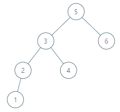

###  二叉搜索树中的中序后继

> 题目:给定一棵二叉搜索树和其中的一个节点 p ，找到该节点在树中的中序后继。如果节点没有中序后继，请返回 null 。

节点 p 的后继是值比 p.val 大的节点中键值最小的节点，即按中序遍历的顺序节点 p 的下一个节点。

示例1：


```js
// 输入：root = [2,1,3], p = 1
// 输出：2
// 解释：这里 1 的中序后继是 2。请注意 p 和返回值都应是 TreeNode 类型。
```

示例2：



```js
// 输入：root = [5,3,6,2,4,null,null,1], p = 6
// 输出：null
// 解释：因为给出的节点没有中序后继，所以答案就返回 null 了。
```

提示:

* 树中节点的数目在范围 [1, 10 ^ 4] 内。
* -10 ^ 5 <= Node.val <= 10 ^ 5
* 树中各节点的值均保证唯一。


> 注意：本题与[主站 285 题](https://leetcode-cn.com/problems/inorder-successor-in-bst/)相同。

### 思路分析

根据题意，下一个节点的值一定不会小于节点p的值，而是大于p的节点值当中的最小一个值，因此我们可以从根节点出发，每到达一个节点，就比较节点的值与p节点值的大小。

* 1. 如果当前节点的值小于等于p节点的值，那么p的后继节点一定在右子树。
* 2. 如果当前节点的值大于p节点的值，那么当前节点的下一个节点有可能是p的后继节点，但不一定是最小值。因此遍历左子树，如果能找到更小的值，则返回那个最小的值，否则就返回当前节点的下一个节点值。

```js
/**
 * Definition for a binary tree node.
 * function TreeNode(val) {
 *     this.val = val;
 *     this.left = this.right = null;
 * }
 */
/**
 * @param {TreeNode} root
 * @param {TreeNode} p
 * @return {TreeNode}
 */
var inorderSuccessor = function(root, p) {
    let curNode = root,
        result = null;
    while(curNode){
        if(curNode.val > p.val){
            result = curNode.val;
            curNode = curNode.left;
        }else{
            curNode = curNode.right;
        }
    }
    return result;
};
```

以上算法的时间复杂度和空间复杂度分析如下:

* 时间复杂度：O(n)。
* 空间复杂度：O(1)。

[更多思路](https://leetcode-cn.com/problems/P5rCT8/solution/shi-jian-fu-za-du-wei-ceng-gao-de-jie-fa-fheg/)。
