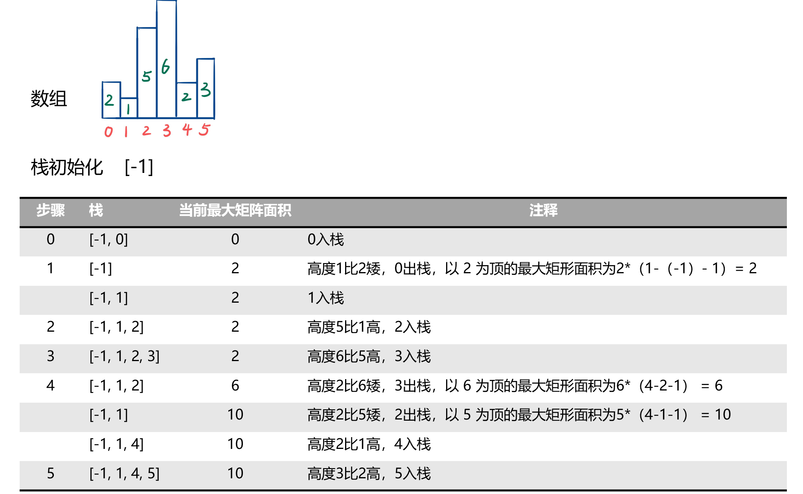
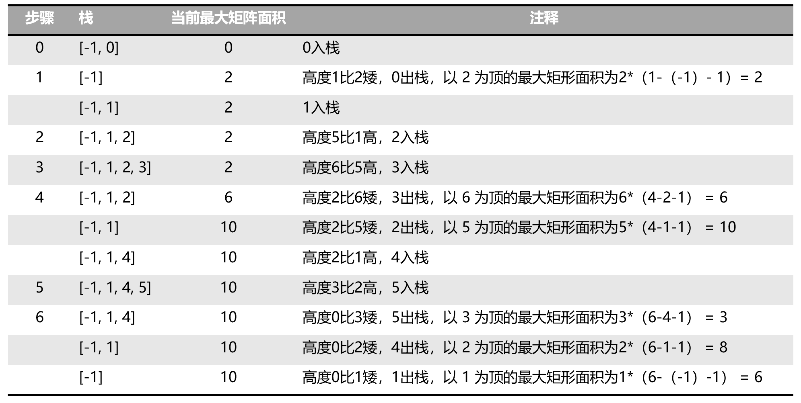

### 直方图最大矩形面积

> 题目:给定非负整数数组 heights ，数组中的数字用来表示柱状图中各个柱子的高度。每个柱子彼此相邻，且宽度为 1 。

求在该柱状图中，能够勾勒出来的矩形的最大面积。

示例1：


```js
// 输入：heights = [2,1,5,6,2,3]
// 输出：10
// 解释：最大的矩形为图中红色区域，面积为 10
```

示例2：


```js
// 输入： heights = [2,4]
// 输出： 4
```


提示:

* 1 <= heights.length <=10 ^ 5
* 0 <= heights[i] <= 10 ^ 4

> 注意：本题与[主站 84 题](https://leetcode-cn.com/problems/largest-rectangle-in-histogram/)相同。

### 思路分析

本题我们可以直接考虑暴力解法来解决。根据题意，很显然，我们只要找到两个最大高度的矩形之间较小的那个高度，然后乘以这两个矩形的宽度。创建两个循环，两个指针之差就是宽度。因此暴力解法如下:

```js
/**
 * @param {number[]} heights
 * @return {number}
 */
var largestRectangleArea = function(heights) {
    let maxArea = 0;
    for(let left = 0;left < heights.length;left++){
        //找到两个最大高度矩形之间的较小高度，默认是第一项
        let minHeight = heights[left];
        for(let right = left;right < heights.length;right++){
            minHeight = Math.min(minHeight,heights[right]);
            //求矩形面积,(right - left + 1) * 1为宽度
            maxArea = Math.max(maxArea,(right - left + 1) * minHeight);
        }
    }
    return maxArea;
};
```

以上算法的时间复杂度和空间复杂度分析如下:

* 时间复杂度：O(n ^ 2)。
* 空间复杂度：O(1)。

不过很显然时间复杂度很高，应该不会满足题意，所以我们需要考虑更高效的解法。接下来我们可以考虑单调栈的解法，所谓单调栈顾名思义，就是栈内的数据是单调有序的。在这里，我们可以使用单调栈保存每一个柱子的高度（当然在这里是保存的柱子对应的下标，即索引）。单调栈的基本思想就是保证存在栈中的柱子的高度是递增的。操作为，从左到右依次扫描数组内的柱子高度，如果当前柱子高度大于了位于栈顶的柱子高度，则当前柱子对应的下标入栈。反之，将栈顶柱子出栈，并计算栈顶柱子为高度的最高矩形面积，直到可入栈为止。

那么我们应该如何确定栈顶柱子为高的最高矩阵面积呢？该矩形的宽度一定是从栈顶柱子的两边出发直到遇到比该柱高矮的柱子所夹成的宽度，换句话说，就是当前柱子的对应索引值减去栈顶柱子对应保存的索引值再减去1即可得到宽度。因为单调栈中保存的柱高是递增的，所以栈中位于栈顶柱子前面的柱子一定是比栈顶柱子矮，同样扫描到当前柱子也矮于位于栈顶的柱子，宽度确定了，那么面积也就好确定了。

以[2,1,5,6,2,3]为例说明，过程如图所示:




通过上图可以发现，最后栈中除了为方便处理而加入的用来初始化的-1以外，还有1,4,5三个元素，对应的就是高度为1,2,3的柱子的下标。也就是说我们还没有计算出以1,2,3位高度的矩形的面积。这是因为，我们并没有找到比这三个柱子还矮的柱子，也就是说，我们最后如果加入一个高度为0的柱子，就可以将除了-1以外的栈中保存的所有柱子的下标都出栈，那么所有柱子对应的矩形面积则都会被计算，找出计算的矩形面积的最大值即可。如下图所示:



```js
/**
 * @param {number[]} heights
 * @return {number}
 */
var largestRectangleArea = function(heights) {
    //初始化一个栈
    const stack = [-1];
    //初始化矩形面积
    let maxArea = 0;
    for(let i = 0;i < heights.length;i++){
        //如果栈顶柱子高度不为-1，并且大于当前柱子的高度，则栈顶元素出栈
        while(stack[stack.length - 1] !== -1 && heights[stack[stack.length - 1]] >= heights[i]){
            const idx = stack.pop(),//出栈为柱高对应的索引
                  height = heights[idx],//矩形高度
                  width = i - stack[stack.length - 1] - 1;//矩形宽度
            //求出矩形面积
            maxArea = Math.max(width * height,maxArea);
        }
        //入栈
        stack.push(i);
    }
    //如果栈顶元素不为-1,则表明还有矩形面积未计算，所以需要再计算一次
    while(stack[stack.length - 1] !== -1){
        const idx = stack.pop(),//出栈为柱高对应的索引
              width = heights.length - stack[stack.length - 1] -1, //矩形宽度
              height = heights[idx];//矩形高度
        maxArea = Math.max(width * height,maxArea);
    }
    return maxArea;
};
```

以上算法的时间复杂度和空间复杂度分析如下:

* 时间复杂度：O(n)。
* 空间复杂度：O(n)。

[更多思路](https://leetcode-cn.com/problems/0ynMMM/solution/jian-zhi-offer-2-mian-shi-ti-39-shu-zhon-qzaw/)。
