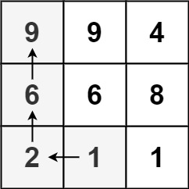

###  最长递增路径
 
> 题目:给定一个 m x n 整数矩阵 matrix ，找出其中 最长递增路径 的长度。对于每个单元格，你可以往上，下，左，右四个方向移动。 不能 在 对角线 方向上移动或移动到 边界外（即不允许环绕）。


示例1：



```js
// 输入：matrix = [[9,9,4],[6,6,8],[2,1,1]]
// 输出：4 
// 解释：最长递增路径为 [1, 2, 6, 9]。
```

示例2：


```js
// 输入：matrix = [[3,4,5],[3,2,6],[2,2,1]]
// 输出：4 
// 解释：最长递增路径是 [3, 4, 5, 6]。注意不允许在对角线方向上移动。
```

示例3：

```js
// 输入：matrix = [[1]]
// 输出：1
```

提示:

* m == matrix.length
* n == matrix[i].length
* 1 <= m, n <= 200
* 0 <= matrix[i][j] <= 2 ^ 31 - 1


> 注意：本题与[主站 329 题](https://leetcode-cn.com/problems/longest-increasing-path-in-a-matrix/)相同。

### 思路分析

将矩阵看成一个有向图，每个单元格对应图中的一个节点，如果相邻的两个单元格的值不相等，则在相邻的两个单元格之间存在一条从较小值指向较大值的有向边。问题转化成在有向图中寻找最长路径。

深度优先搜索是非常直观的方法。从一个单元格开始进行深度优先搜索，即可找到从该单元格开始的最长递增路径。对每个单元格分别进行深度优先搜索之后，即可得到矩阵中的最长递增路径的长度。但是如果使用朴素深度优先搜索，时间复杂度是指数级，会超出时间限制，因此必须加以优化。

朴素深度优先搜索的时间复杂度过高的原因是进行了大量的重复计算，同一个单元格会被访问多次，每次访问都要重新计算。由于同一个单元格对应的最长递增路径的长度是固定不变的，因此可以使用记忆化的方法进行优化。用矩阵 memo 作为缓存矩阵，已经计算过的单元格的结果存储到缓存矩阵中。使用记忆化深度优先搜索，当访问到一个单元格 (i,j) 时，如果 memo[i][j] = 0，说明该单元格的结果已经计算过，则直接从缓存中读取结果，如果memo[i][j] = 0，说明该单元格的结果尚未被计算过，则进行搜索，并将计算得到的结果存入缓存中。遍历完矩阵中的所有单元格之后，即可得到矩阵中的最长递增路径的长度。

```js
/**
 * @param {number[][]} matrix
 * @return {number}
 */
var longestIncreasingPath = function(matrix) {
    if(!matrix || !matrix.length || !matrix[0].length){
        return 0;
    }
    const dirs = [[-1,0],[1,0],[0,-1],[0,1]],
          rows = matrix.length,
          cols = matrix[0].length,
          memo = new Array(rows).fill(0).map(() => new Array(cols).fill(0));
    const dfs = (row,col) => {
        if(memo[row][col] !== 0){
            return memo[row][col];
        }
        memo[row][col]++;
        for(const dir of dirs){
            const newRow = row + dir[0],
                  newCol = col + dir[1];
            if(newRow >= 0 && newRow < rows && newCol >= 0 && newCol < cols && matrix[newRow][newCol] > matrix[row][col]){
                memo[row][col] = Math.max(memo[row][col],dfs(newRow,newCol) + 1);
            }
        }
        return memo[row][col];
    }
    let ans = 0;
    for(let i = 0;i < rows;i++){
        for(let j = 0;j < cols;j++){
            ans = Math.max(ans,dfs(i,j));
        }
    }
    return ans;
};
```

以上算法的时间复杂度和空间复杂度分析如下:

* 时间复杂度：O(m * n),其中 m 和 n 分别是矩阵的行数和列数。深度优先搜索的时间复杂度是 O(V + E)，其中 V 是节点数，E 是边数。在矩阵中，O(V) = O(m * n)，O(E) ≈ O(4 * m * n)=O(m * n)。
* 空间复杂度：O(m * n),其中 m 和 n 分别是矩阵的行数和列数。空间复杂度主要取决于缓存和递归调用深度，缓存的空间复杂度是 O(m * n)，递归调用深度不会超过 m * n。

[更多思路](https://leetcode.cn/problems/fpTFWP/solution/zui-chang-di-zeng-lu-jing-by-leetcode-so-1chr/)。
