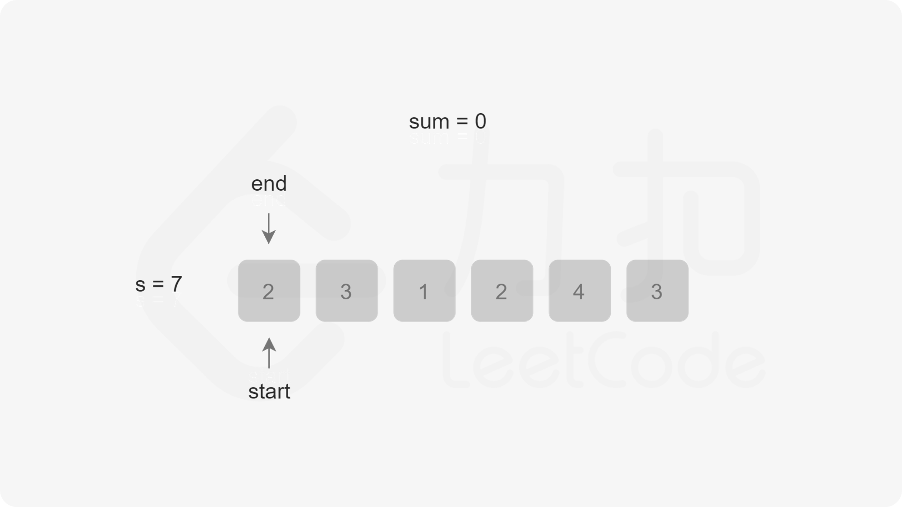
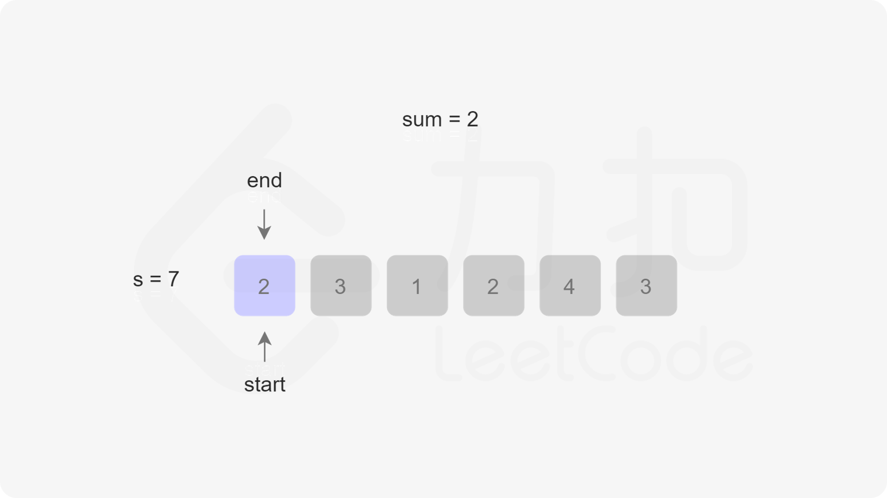
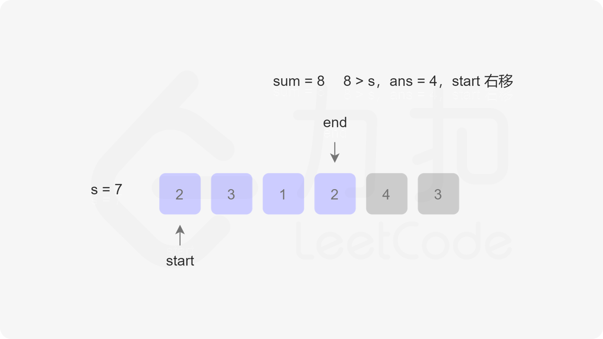
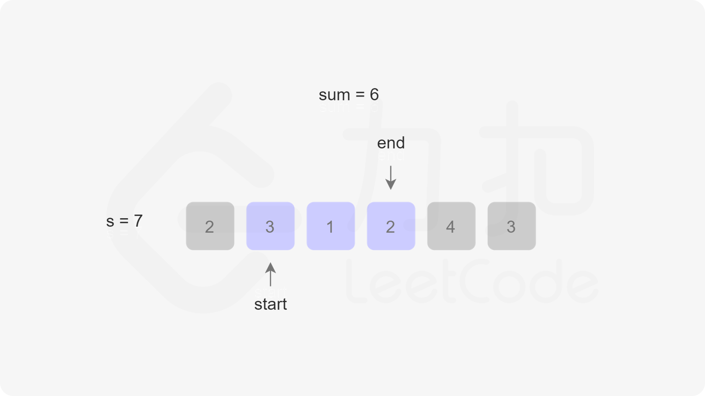
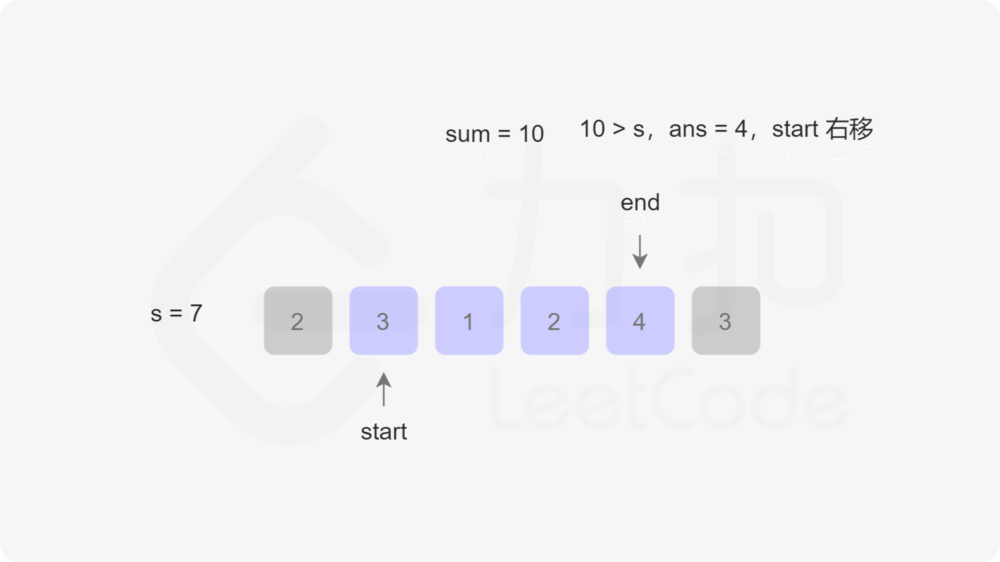

### 和大于等于 target 的最短子数组
<sub>
> 题目:给定一个含有 n 个正整数的数组和一个正整数 target 。找出该数组中满足其和 ≥ target 的长度最小的 连续子数组 [nums<sub>l</sub>, nums<sub>l+1</sub>, ..., nums<sub>r-1</sub>, nums<sub>r</sub>] ，并返回其长度。如果不存在符合条件的子数组，返回 0 。

示例 1：

```js
// 输入：target = 7, nums = [2,3,1,2,4,3]
// 输出：2
// 解释：子数组 [4,3] 是该条件下的长度最小的子数组。
```

示例 2：

```js
// 输入：target = 4, nums = [1,4,4]
// 输出：1
```

示例 3：

```js
// 输入：target = 11, nums = [1,1,1,1,1,1,1,1]
// 输出：0
```

提示:

* 1 <= target <= 10 ^ 9
* 1 <= nums.length <= 10 ^ 5
* 1 <= nums[i] <= 10 ^ 5

> 注意：本题与[主站 209 题](https://leetcode-cn.com/problems/minimum-size-subarray-sum/)相同。

### 思路分析

本题我们可以使用滑动窗口的算法来解决。在开始之前，我们首先需要判断边界问题，即当数组nums的长度为0，我们不需要求结果，直接返回0即可。然后我们可以定义一个开始指针start，结束指针end，以及求和用的sum变量，初始值都是0，然后用一个变量来代表满足连续子数组长度的最小值，初始值为Infinity，记为res。我们先固定开始指针，在end满足小于nums数组的长度下开始自增，然后开始求和nums[end]。当sum大于target的时候，满足了题意，此时我们应该知道连续子数组的长度res就等于res和end - start + 1的最小值。伪代码如下:

```js
res = Math.min(res,end - start + 1);
```

由于此时不一定还循环完，也就是说res不一定是最小值，因此我们还需要右移开始指针start，右移一次的同时sum需要减一个nums[start]。最后我们判断res是否等于Infinity，如果等于则返回0，否则返回res。我们以第一个示例为例，下图展示了指针移动的过程:










```js
/**
 * @param {number} target
 * @param {number[]} nums
 * @return {number}
 */
var minSubArrayLen = function(target, nums) {
    const len = nums.length;
    if(len === 0){
        return len;
    }
    let start = 0,
        end = 0,
        sum = 0,
        res = Infinity;
    while(end < len){
        sum += nums[end];
        while(sum >= target){
            res = Math.min(end - start + 1,res);
            sum -= nums[start];
            start++;
        }
        end++;
    }
    return res === Infinity ? 0 : res;
};
```

以上算法的时间复杂度和空间复杂度分析如下:

* 时间复杂度:O(n ^ 2)。最坏情况下第一个while循环使用O(n),第二个循环也是O(n)。

* 空间复杂度:O(1),使用常数的空间。

[更多思路](https://leetcode-cn.com/problems/2VG8Kg/solution/he-da-yu-deng-yu-target-de-zui-duan-zi-s-ixef/)。
