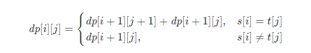

###  子序列的数目
 
> 题目:给定一个字符串 s 和一个字符串 t ，计算在 s 的子序列中 t 出现的个数。

字符串的一个 子序列 是指，通过删除一些（也可以不删除）字符且不干扰剩余字符相对位置所组成的新字符串。（例如，"ACE" 是 "ABCDE" 的一个子序列，而 "AEC" 不是）

题目数据保证答案符合 32 位带符号整数范围。

示例1：

```js
// 输入：s = "rabbbit", t = "rabbit"
// 输出：3
// 解释：
// 如下图所示, 有 3 种可以从 s 中得到 "rabbit" 的方案。
// rabbbit
// rabbbit
// rabbbit
```


示例2：

```js
// 输入：s = "babgbag", t = "bag"
// 输出：5
// 解释：
// 如下图所示, 有 5 种可以从 s 中得到 "bag" 的方案。 
// babgbag
// babgbag
// babgbag
// babgbag
// babgbag
```

提示:

* 0 <= s.length, t.length <= 1000
* s 和 t 由英文字母组成


> 注意：本题与[主站 115 题](https://leetcode-cn.com/problems/distinct-subsequences/)相同。

### 思路分析

假设字符串s和t的长度分别为m和n,如果t是s的子序列，则s的长度一定大于等于t的长度，即只有当m >= n的时候，t才可能是s的子序列。如果m < n，则t一定不是s的子序列，因此直接返回0。当m>=n时，可以通过动态规划的方法来计算在s的子序列中t出现的个数。

创建二维数组dp,其中dp[i][j]表示在s[i:]的子序列中t[j:]出现的个数。

> 上述表示中，s[i:]表示s从下标i到末尾的子字符串，t[j:]表示t从下标j到末尾的子字符串。

考虑动态规划的边界情况:

* 当j = n的时候，t[j:]为空字符串，由于空字符串是任何字符串的子序列，因此对于任意的0 <=i <= m，都有dp[i][n] = 1。
* 当i = m且j < n时，s[i:]为空字符串，t[j:]为非空字符串，由于非空字符串不是空字符串的子序列，因此对于任意的0 <= j < n，都有dp[m][j] = 0。

当i < m且j < n时，考虑dp[i][j]的计算:

* 当s[i] = t[j]时，dp[i][j]由两部分组成:
    * 如果s[i]和t[j]匹配，则考虑t[j + 1:]作为s[i + 1:]的子序列，子序列数位dp[i + 1][j + 1]。 
    * 如果s[i]和t[j]不匹配，则考虑t[j:]作为s[i + 1:]的子序列，子序列数位dp[i + 1][j]。 
    因此当s[i] = t[j]时，有dp[i][j] = dp[i + 1][j + 1] + dp[i + 1][j]。
* 当s[i] != t[j]时,即s[i]不能和t[j]匹配，因此只考虑t[j:]作为s[i+1:]的子序列，子序列数为dp[i + 1][j]。因此当s[i] != t[j]时，dp[i][j] = dp[i + 1][j]。

由此可以得到如下的状态转移方程:



最终计算dp[0][0]即为在s的子序列中t出现的个数。


```js
/**
 * @param {string} s
 * @param {string} t
 * @return {number}
 */
var numDistinct = function(s, t) {
    const m = s.length,
          n = t.length;
    if(m < n){
        return 0;
    }
    const dp = new Array(m + 1).fill(0).map(() => new Array(n + 1).fill(0));
    for(let i = 0;i <= m;i++){
        dp[i][n] = 1;
    }
    for(let i = m - 1;i >= 0;i--){
        for(let j =  n - 1;j >= 0;j--){
            if(s[i] === t[j]){
                dp[i][j] = dp[i + 1][j + 1] + dp[i + 1][j];
            }else{
                dp[i][j] = dp[i + 1][j];
            }
        }
    }
    return dp[0][0];
};
```

以上算法的时间复杂度和空间复杂度分析如下:

* 时间复杂度：O(m * n)其中 m 和 n 分别是字符串 s 和 t 的长度。二维数组 dp 有 m+1 行和 n+1 列，需要对dp中的每个元素进行计算。
* 空间复杂度：O(m * n)其中 m 和 n 分别是字符串 s 和 t 的长度。创建了 m+1 行 n+1 列的二维数组dp。


[更多思路](https://leetcode-cn.com/problems/21dk04/solution/zi-xu-lie-de-shu-mu-by-leetcode-solution-l8v1/)。
