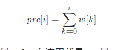

###  按权重生成随机数

> 题目:给定一个正整数数组 w ，其中 w[i] 代表下标 i 的权重（下标从 0 开始），请写一个函数 pickIndex ，它可以随机地获取下标 i，选取下标 i 的概率与 w[i] 成正比。

例如，对于 w = [1, 3]，挑选下标 0 的概率为 1 / (1 + 3) = 0.25 （即，25%），而选取下标 1 的概率为 3 / (1 + 3) = 0.75（即，75%）。

也就是说，选取下标 i 的概率为 w[i] / sum(w) 。

示例1：

```js
// 输入：
// inputs = ["Solution","pickIndex"]
// inputs = [[[1]],[]]
// 输出：
// [null,0]
// 解释：
// Solution solution = new Solution([1]);
// solution.pickIndex(); // 返回 0，因为数组中只有一个元素，所以唯一的选择是返回下标 0。
```

示例2：

```js
// 输入：
// inputs = ["Solution","pickIndex","pickIndex","pickIndex","pickIndex","pickIndex"]
// inputs = [[[1,3]],[],[],[],[],[]]
// 输出：
// [null,1,1,1,1,0]
// 解释：
// Solution solution = new Solution([1, 3]);
// solution.pickIndex(); // 返回 1，返回下标 1，返回该下标概率为 3/4 。
// solution.pickIndex(); // 返回 1
// solution.pickIndex(); // 返回 1
// solution.pickIndex(); // 返回 1
// solution.pickIndex(); // 返回 0，返回下标 0，返回该下标概率为 1/4 。

// 由于这是一个随机问题，允许多个答案，因此下列输出都可以被认为是正确的:
// [null,1,1,1,1,0]
// [null,1,1,1,1,1]
// [null,1,1,1,0,0]
// [null,1,1,1,0,1]
// [null,1,0,1,0,0]
// ......
// 诸若此类。
```

提示:

* 1 <= w.length <= 10000
* 1 <= w[i] <= 10^5
* pickIndex 将被调用不超过 10000 次

> 注意：本题与[主站 528 题](https://leetcode-cn.com/problems/random-pick-with-weight/)相同。

### 思路分析

假设一个正整数数组w的权重之和为total,根据题意，我们可以将本题看成是[1,total]范围内的所有正整数分成n个部分，而这个n就是数组w的长度，第i个部分刚好包含w[i]个整数，并且这n个部分交集为空（也就是没有重复部分），随后我们需要在[1,total]范围内找到一个整数x，如果这个整数x被包含在第i个部分内，我们就返回i。

那么我们应该如何划分这个数组？一种简单的办法就是按照从小到大的顺序来依次划分每个部分。例如当w = [3,1,2,4]的时候，权重之和total = 10,那么我们按照[1,3],[4,4],[5,6],[7,10]对[1,10]来进行划分，使得它们的长度刚好是3,1,2,4(right - left + 1,即右边界减去左边界 + 1为长度)。可以发现，每个区间的左边界是在它之前出现的所有元素之和加1，例如第二部分左边界4 = w[0] + 1 = 3 + 1 = 4,第一部分左边界默认很明显就是1，因为它在数组w中，之前的元素没有，所以就是1，依次类推。而每个区间的右边界则是到它为止的元素之和，例如3 = w[0] = 3,4 = w[0] + w[1] = 3 + 1 = 4，依次类推。可以看到，这就是前缀和的计算。

因此，如果我们用pre[i]来表示数组w[i]的前缀和。公式如下:



根据该公式，第i个区间左边界就是pre[i] - w[i] + 1,右边界就是pre[i]。当划分完成后，假设我们随机取到了整数x,我们希望找到满足:

pre[i] - w[i] + 1 <= x <= pre[i]

的i并将其作为答案来返回，由于pre[i]是单调递增的，因此我们可以使用二分查找(O(log<sup>n</sup>))的时间复杂度来遍历到i,即找出最小的满足x <= pre[i]的下标。代码如下:


```js
/**
 * @param {number[]} w
 */
var Solution = function(w) {
    //存储前缀和需要用到数组
    this.pre = [];
    //初始化前缀和数组第一项
    this.pre[0] = w[0];
    //初始化前缀和
    for(let i = 0;i < w.length;i++){
        this.pre[i] = this.pre[i - 1] + w[i];
    }
    //初始化权重和
    this.total = w.reduce((t,i) => t += i,0);
};

/**
 * @return {number}
 */
Solution.prototype.pickIndex = function() {
    //取随机数
    const random = Math.floor(Math.random() * this.total) + 1;
    const binarySearch = x => {
        let low = 0,high = this.pre.length - 1;
        while(low < high){
            const mid = Math.floor((low + high) / 2);
            if(this.pre[mid] < x){
                low = mid + 1;
            }else{
                high = mid;
            }
        }
        //这里返回low就找到了最小的x
        return low;
    }
    return binarySearch(random);
};

/**
 * Your Solution object will be instantiated and called as such:
 * var obj = new Solution(w)
 * var param_1 = obj.pickIndex()
 */
```

以上算法的时间复杂度和空间复杂度分析如下:

* 时间复杂度：初始化的时间复杂度为 O(n)，每次选择的时间复杂度为 O(log<sup>n</sup>)，其中 n 是数组 w 的长度。
* 空间复杂度：O(n)，即为前缀和数组 pre 需要使用的空间。

[更多思路](https://leetcode-cn.com/problems/cuyjEf/solution/an-quan-zhong-sheng-cheng-sui-ji-shu-by-bosxd/)。
