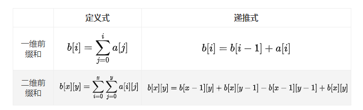

### 和为 k 的子数组

> 题目:给定一个整数数组和一个整数 k ，请找到该数组中和为 k 的连续子数组的个数。


示例 1：

```js
// 输入:nums = [1,1,1], k = 2
// 输出: 2
// 解释: 此题 [1,1] 与 [1,1] 为两种不同的情况
```

示例 2：

```js
// 输入:nums = [1,2,3], k = 3
// 输出: 2
```

提示:

* 1 <= nums.length <= 2 * 10 ^ 4
* -1000 <= nums[i] <= 1000
* -10 ^ 7 <= k <= 10 ^ 7

> 注意：本题与[主站 560 题](https://leetcode-cn.com/problems/subarray-sum-equals-k/)相同。

### 思路分析

本题需要用到一个新的算法，叫做前缀和算法，也叫差分算法，所谓的前缀和，意思就是一个数组的某项下标以及某项之前的下标的所有元素的和。前缀和算法有两种，如下图所示:



当然在详解前缀和算法之前，先要知道为什么这里不能用滑动窗口算法，因为这里存在负数的情况。现在我们再回到本题，由于存在负数，因此我们可以循环到第i项的时候，计算第i项之前的累加和，然后再减去k，并且用哈希表来存储，如果哈希表中存在这个累加和，就代表一定有符合条件的数组项累加起来等于k，因此我们就可以给结果值加1。详细算法流程如下:

1. 初始化前缀和变量以及哈希表。
2. 初始化哈希表的初始值即{0 : 1}。
3. 计算累加和。
4. 将累加和减去k值，然后判断哈希表中是否存在该值，存在则加1，不存在则就等于1，然后将结果值加该哈希表中存储的值。
5. 返回结果值。

详情代码如下:

```js
/**
 * @param {number[]} nums
 * @param {number} k
 * @return {number}
 */
var subarraySum = function(nums, k) {
    // 初始化哈希表和长度
    const map = new Map(),
          len = nums.length;
    //初始化前缀和与结果值
    let sum = 0,res = 0;
    // 初始化哈希表的初始值
    map.set(0,1);
    for(let i = 0;i < len;i++){
        // 计算累加和
        sum += nums[i];
        res += map.get(sum - k) || 0;
        map.set(sum,(map.get(sum) || 0) + 1);
    }
    return res;
};
```

以上算法的时间复杂度和空间复杂度分析如下:

* 时间复杂度O(n)：一轮循环需要n次。
* 空间复杂度O(n):哈希表存储一个元素占用O(1)空间。

[更多思路](https://leetcode-cn.com/problems/QTMn0o/solution/shua-chuan-jian-zhi-offer-day07-shu-zu-i-jdnu/)。
