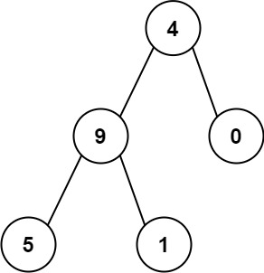
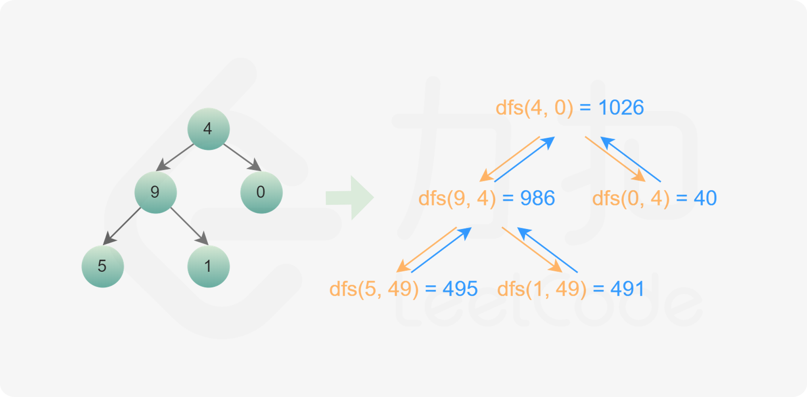

###  从根节点到叶节点的路径数字之和

> 题目:给定一个二叉树的根节点 root ，树中每个节点都存放有一个 0 到 9 之间的数字。

每条从根节点到叶节点的路径都代表一个数字：

* 例如，从根节点到叶节点的路径 1 -> 2 -> 3 表示数字 123 。

计算从根节点到叶节点生成的 所有数字之和 。叶节点 是指没有子节点的节点。

示例1：


```js
// 输入：root = [1,2,3]
// 输出：25
// 解释：
// 从根到叶子节点路径 1->2 代表数字 12
// 从根到叶子节点路径 1->3 代表数字 13
// 因此，数字总和 = 12 + 13 = 25
```



示例2：

```js
// 输入：root = [4,9,0,5,1]
// 输出：1026
// 解释：
// 从根到叶子节点路径 4->9->5 代表数字 495
// 从根到叶子节点路径 4->9->1 代表数字 491
// 从根到叶子节点路径 4->0 代表数字 40
// 因此，数字总和 = 495 + 491 + 40 = 1026
```

提示:

* 树中节点的数目在范围 [1, 1000] 内
* 0 <= Node.val <= 9
* 树的深度不超过 10


> 注意：本题与[主站 129 题](https://leetcode-cn.com/problems/sum-root-to-leaf-numbers/)相同。

### 思路分析

这道题中，根据题意，每一个从根节点到叶子节点的路径为一个数字。我们观察一下二叉树的结构，可以发现，每一个节点都对应一个数字，然后求出该节点的父节点到该节点的和的计算公式应该为该节点的父节点的值乘以10再加上该节点的值（当然这里需要假设根节点的父节点的值是0）。例如对于root = [4,9,0,5,1]示例，当当前节点是9的时候，从其父节点到该节点的路径之和就为4 * 10 + 9 = 49，再比如当前节点是5的时候，则从当前节点的父节点到该节点的路径组成的数字之和就为49 * 10 + 5 = 495。根据这个规律，我们只要遍历出每一条路径，然后计算每条路径之和，即可得到结果。因此采用深度优先搜索算法最为直观。如下图所示:



```js
/**
 * Definition for a binary tree node.
 * function TreeNode(val, left, right) {
 *     this.val = (val===undefined ? 0 : val)
 *     this.left = (left===undefined ? null : left)
 *     this.right = (right===undefined ? null : right)
 * }
 */
/**
 * @param {TreeNode} root
 * @return {number}
 */
var sumNumbers = function(root) {
    return dfs(root,0);
};
var dfs = function(node,prevSum){
    if(node === null){
        return 0;
    }
    const sum = prevSum * 10 + node.val;
    //如果当前节点没有左子树和右子树，则表示没有路径，和已经计算完成，直接返回结果即可
    if(node.left === null && node.right === null){
        return sum;
    }else{
        return dfs(node.left,sum) + dfs(node.right,sum);
    }
}
```

以上算法的时间复杂度和空间复杂度分析如下:

* 时间复杂度：O(n)，其中 n 是二叉树的节点个数。对每个节点访问一次。。
* 空间复杂度：O(n)，其中 n 是二叉树的节点个数。空间复杂度主要取决于递归调用的栈空间，递归栈的深度等于二叉树的高度，最坏情况下，二叉树的高度等于节点个数，空间复杂度为 O(n)。

[更多思路](https://leetcode-cn.com/problems/3Etpl5/solution/cong-gen-jie-dian-dao-xie-jie-dian-de-lu-nv9q/)。
