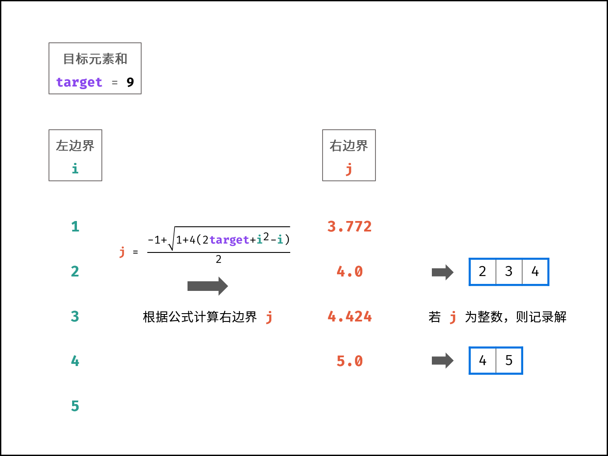

### 和为s的连续正数序列

> 题目:输入一个正整数 target ，输出所有和为 target 的连续正整数序列（至少含有两个数）。序列内的数字由小到大排列，不同序列按照首个数字从小到大排列。


示例 1：

```js
// 输入：target = 9
// 输出：[[2,3,4],[4,5]]
```

示例 2：

```js
// 输入：target = 15
// 输出：[[1,2,3,4,5],[4,5,6],[7,8]]
```

限制:

* 1 <= target <= 10 ^ 5

### 思路分析

对于本题，我们需要知道一个求和公式。设连续正整数序列的左边界l和右边界r，则此序列的元素和target等于平均值(l + r) / 2乘以元素数量(r - l + 1),即:

```js
target = (l + r) * (r - l + 1) / 2
```

并且在这里我们应该知道l应该是大于等于1的，而r应该是大于等于2的。因为如果target小于等于2，那根本就没有超过2个数的连续正整数序列，不符合题意。展开这个公式，我们可以得到:

```js
target = (r ^ 2 + r - l ^ 2 + l ) / 2
//=>
0 =  r ^ 2 + r - (2 * target + l ^ 2 - l)
```

根据观察，我们知道如果target和l已知，则r的结果就是一个一元二次方程。根据[一元二次方程的求根公式](https://baike.baidu.com/item/%E4%B8%80%E5%85%83%E4%BA%8C%E6%AC%A1%E6%96%B9%E7%A8%8B%E6%B1%82%E6%A0%B9%E5%85%AC%E5%BC%8F/56066624?fr=aladdin)可得:

```js
j = (-b (+ / -) Math.sqrt(b ^ 2 - 4 * a * c)) / 2a = (-1 (+ / -) Math.sqrt(1 + 4 * (2 * target + l ^ 2 - l))) / 2
```

由于r  > l 恒成立，因此必须舍去负数的解，即:

```js
j = (-1 + Math.sqrt(1 + 4 * (2 * target + l ^ 2 - l))) / 2
```

因此，通过从小到大遍历左边界l来计算以l为起始数字的连续正整数序列，每轮中，根据以上公式可以得到右边界r,当r满足以下2个条件是记录结果（用一个数组来存储，添加到数组中去）:

1. r为整数：符合题目的所有正整数连续序列。
2. l < r: 满足题目至少要求两个数。

> 当target= 9时，以上求解流程如下图所示:



详情代码如下:

```js
/**
 * @param {number} target
 * @return {number[][]}
 */
var findContinuousSequence = function(target) {
    // 初始化左边界与右边界以及记录结果数组
    let l = 1,r = 2,res = [];
    // 遍历左边界
    while(l < r){
        // 计算右边界，根据公式
        r = (-1 + Math.sqrt(1 + 4 * (2 * target + l * l - l))) / 2;
        // 判断r是否为整数(与1取余即可判断)并且l < r
        if(l < r && r % 1 === 0){
            // 初始化序列数组
            let ans = new Array(r - l + 1);
            for(let k = l;k <= r;k++){
                // 存储每一个连续数字
                 ans[k - l] = k;
            }
            // 添加到结果数组中
            res.push(ans);
        }
        l++;
    }
    // 返回结果数组
    return res;
};
```

时间复杂度 O(n)： 其中 n = target；连续整数序列至少有两个数字，而 i < j 恒成立，因此至多循环 target / 2次，使用 O(n)时间；循环内，计算 j 使用 O(1) 时间；当 i = 1 时，达到最大序列长度，考虑到解的稀疏性，将列表构建时间简化考虑为 O(1)；
空间复杂度 O(1)： 变量 i , j 使用常数大小的额外空间。


更多详细解题思路参考[题解](https://leetcode-cn.com/problems/he-wei-sde-lian-xu-zheng-shu-xu-lie-lcof/solution/jian-zhi-offer-57-ii-he-wei-s-de-lian-xu-t85z/)。

