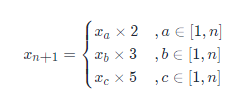
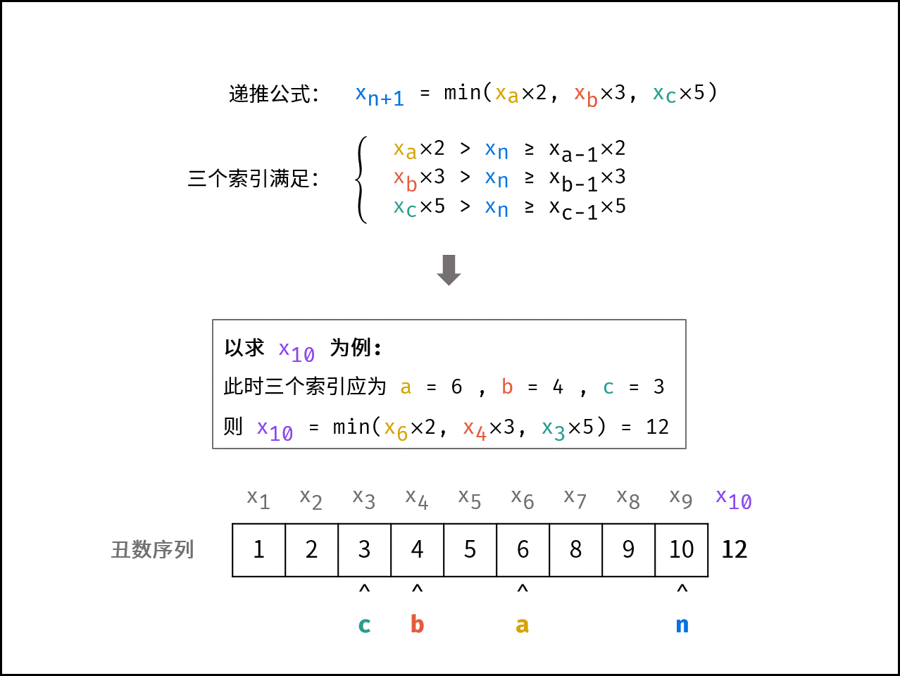
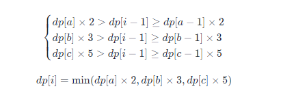

### 丑数

> 题目:我们把只包含质因子 2、3 和 5 的数称作丑数（Ugly Number）。求按从小到大的顺序的第 n 个丑数。


示例:

```js
// 输入: n = 10
// 输出: 12
// 解释: 1, 2, 3, 4, 5, 6, 8, 9, 10, 12 是前 10 个丑数。
```

说明:

* 1 是丑数。
* n 不超过1690。

### 思路分析

> 丑数的递推性质:丑数只包含2,3,5这三个因子，因此有"丑数=某较小丑数 * 某因子"(例如:10 = 5 * 2)

设已知长度为n的丑数序列x<sub>1</sub>,x<sub>2</sub>,...,x<sub>n</sub>,求第n + 1个丑数x<sub>n + 1</sub>。根据递推性质，丑数x<sub>n + 1</sub>只可能包含三种情况，如下所示:

;

丑数递推公式:如果a,b,c满足以上条件，则下个丑数x<sub>n + 1</sub>为以下三种情况的`最小值`。

x<sub>n + 1</sub> = min(x<sub>a</sub> * 2,x<sub>b</sub> * 3,x<sub>c</sub> * 5)

由于x<sub>n + 1</sub>是最接近x<sub>n</sub>的丑数，因此索引a,b,c需要满足以下条件。

;

;

因此，可设置指针a,b,c指向首个丑数，即1。循环根据递推公式得到下个丑数，并每轮对应指针加1即可。

动态规划解析:

* 状态定义:设动态规划列表dp,dp[i + 1]代表第i + 1个丑数。
* 状态转移方程:
    * 当索引a,b,c满足以下条件的时候，dp[i]为三种情况的最小值。
    * 每轮计算dp[i]后，需要更新a,b,c的值,使其始终满足方程条件。实现方法:分别独立判断dp[i]和dp[a] * 2,dp[b] * 3,dp[c] * 5的大小关系，若相等则将对应的索引自增1。

;


* 初始状态:dp[0] = 1,即第一个丑数为1。
* 返回值dp[n - 1],即返回第n个丑数。


```js
var nthUglyNumber = function(n){
    // 初始化动态规划列表，填充每一个数组项元素为0
    let dp = new Array(n).fill(0);
    // 初始状态值为1
    dp[0] = 1;
    //定义三个变量a,b,c
    let a = 0,b = 0,c = 0;
    //循环遍历，由于初始值为1，因此从2开始遍历
    for(let i = 2;i <= dp.length;i++){
        //获取dp[a] * 2,dp[b] * 3,dp[c] * 5
        let ra = dp[a] * 2,rb = dp[b] * 3,rc = dp[c] * 5;
        // dp[i - 1]为三者的最小值
        dp[i - 1] = Math.min(ra,rb,rc);
        //分别判断等于哪个值，则对应的索引自增1
        if(dp[i - 1] === ra){
            a++;
        }
        if(dp[i  - 1] === rb){
            b++;
        }
        if(dp[i - 1] === rc){
            c++;
        }
    }
    // 返回第n-1个丑数
    return dp[n - 1];
}
```

时间复杂度：需要计算数组dp中的n个元素，每个元素的计算都可以在O(1)的时间内完成。
空间复杂度：O(n)。空间复杂度主要取决于数组 dp 的大小。
更多详细解题思路参考[题解](https://leetcode-cn.com/problems/chou-shu-lcof/solution/chou-shu-by-leetcode-solution-0e5i/)。

