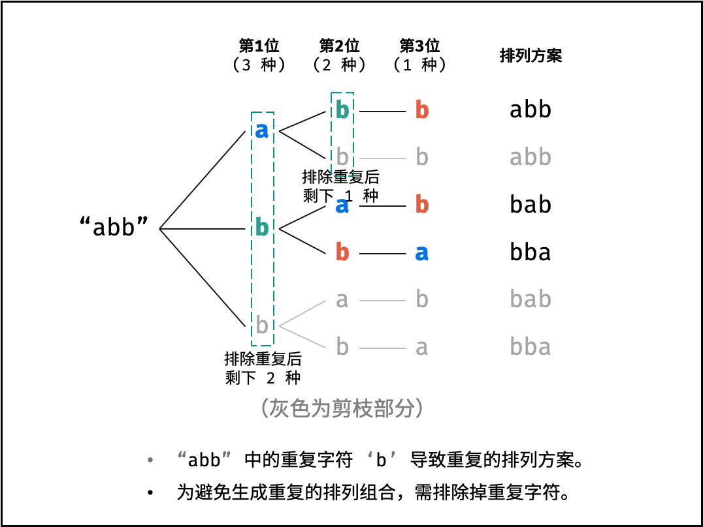

### 字符串的排列

> 题目:输入一个字符串,打印出该字符串中字符的所有排列。你可以以任意顺序返回这个字符串数组,但里面不能有重复元素。


示例:

```js
// 输入：s = "abc"
// 输出：["abc","acb","bac","bca","cab","cba"]
```

限制：

1 <= s 的长度 <= 8

### 思路分析

解答本题还需要知道排列与组合的数学知识,也就是对于一个长度为n的字符串(假设字符串中的字符互不重复),其排列方案数共有:

```js
n * (n - 1) * (n - 2) * ... * 2 * 1
```

根据字符串的排列特点,我们可以考虑深度优先搜索方案,即通过字符交换,先固定第1位字符(n种情况),再固定第2位字符(n-1种情况),...最后固定第n位字符(1种情况)。如下图所示:


但是我们需要注意一点,那就是当字符串存在重复字符的时候,我们应该知道排列方案也会存在重复的情况。此时我们就需要排除重复的方案,需要在固定字符的同时,保证每个字符只能在此位固定一次,即遇到重复字符时不交换,直接跳过,从DFS深度优先搜索的角度来看,这被叫做剪枝。



我们首先可以创建一个Set数据结构来存储每一种组合,然后开始利用深度优先搜索递归拼接每一个字符,当我们组合的长度等于字符串的长度的时候,就代表这是一种方案,添加到Set数据结构中,然后我们需要创建一个对象来区分重复的组合情况,我们在深度优先搜索的过程中遍历每一个字符,然后当字符重复了就跳过,然后开始递归拼接字符。详细代码如下所示:

```js
var permutation = function(s) {
    const res = new Set(),isRepeat = {},l = s.length;
    const DFS = function(path){
        if(path.length === l){
            res.add(path);
        }
        for(let i = 0;i < l;i++){
            if(isRepeat[i]){
                continue;
            }
            isRepeat[i] = true;
            DFS(path + s[i]);
            isRepeat[i] = false;
        }
    }
    DFS("");
    return [...res];
};
```

时间复杂度O(n!n):n为字符串s的长度;时间复杂度和字符串排列的方案数成线性关系,方案数为 n * (n-1) * (n-2) … * 2 * 1,即复杂度为 O(n!);字符串拼接操作join()使用O(n);因此总体时间复杂度为O(n!n)。

空间复杂度O(n^2):全排列的递归深度为n,系统累计使用栈空间大小为O(n);递归中辅助Set累计存储的字符数量最多为n + (n-1) + ... + 2 + 1 = (n+1) * n/2,即占用 O(n^2)的额外空间。

更多详细解题思路参考[题解](https://leetcode-cn.com/problems/zi-fu-chuan-de-pai-lie-lcof/solution/zi-fu-chuan-de-pai-lie-by-leetcode-solut-hhvs/)。

