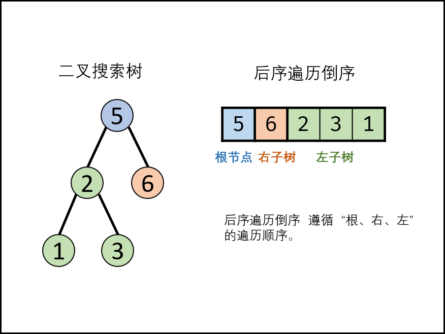

### 二叉搜索树的后序遍历序列

> 题目:输入一个整数数组，判断该数组是不是某二叉搜索树的后序遍历结果。如果是则返回 true，否则返回 false。假设输入的数组的任意两个数字都互不相同。

参考以下这颗二叉搜索树：

```js
//      5
//     / \
//    2   6
//   / \
//  1   3
```

示例 1：

```js
// 输入: [1,6,3,2,5]
// 输出: false
```

示例 2：

```js
// 输入: [1,3,2,6,5]
// 输出: true
```

> 提示: 数组长度 <= 1000

### 思路分析

在说思路之前首先我们需要明白一点后序遍历的顺序`左->右->根`而它的倒序则为`根->右->左`。如下图所示:




假设后序遍历倒序列表为`[r(n),r(n - 1)...r1]`,遍历此列表，记索引为i，若为二叉搜索树，则一定有如下特点:

1.当节点值r[i] > r[i + 1]时，则r[i]一定是r[i + 1]的右节点。
2.当节点r[i] < r[i + 1]时，则r[i]一定是某个root节点的左子节点，且root节点为r[i + 1],r[i + 2]...r[n]中值大于且最接近r[i]的节点，这是因为root是直接连接的左子节点r[i]。

当遍历时遇到递减节点r[i] < r[i + 1],若为二叉搜索树，则对于后序遍历中节点r[i]的右边任意节点r[x]∈[r(i - 1),r(i - 2)...r(1)],必有r[x] < root。

> 节点r[x]只可能为以下两种情况:(1).r[x]为r[i]的左右子树各节点；(2).r[x]为root的父节点或更高层父节点的左子树的各节点，在二叉搜索树中，以上各节点一定小于root节点。

遍历 “后序遍历的倒序” 会多次遇到递减节点r[i]，若所有的递减节点r[i]对应的父节点root都满足以上条件，则可判定为二叉搜索树。以如下二叉搜索树为例:

```js
//      5
//     / \
//    2   6
//   / \
//  1   3
```

我们定义成倒序列表，则为[5,6,2,3,1],遍历此列表，当r[i] > r[i + 1]，例如3 > 1（即r[1] > r[0]）,则6是2的右节点，当r[i] < r[i + 1]，如2 < 3(即r[2] < r[3]),则2是根节点5的左子节点，（注意索引是倒序开始的，也就是从4开始，所以索引应该是4->3->2->1->0）

```js
/**
 * @param {number[]} postorder
 * @return {boolean}
 */
var verifyPostorder = function(postorder) {
   
};
```

时间复杂度 O(N) ： 遍历 postorder 所有节点，各节点均入栈 / 出栈一次，使用 O(N) 时间。
空间复杂度 O(N) ： 最差情况下，单调栈 stack 存储所有节点，使用 O(N) 额外空间。


[更多思路](https://leetcode-cn.com/problems/er-cha-sou-suo-shu-de-hou-xu-bian-li-xu-lie-lcof/solution/mian-shi-ti-33-er-cha-sou-suo-shu-de-hou-xu-bian-6/)。
